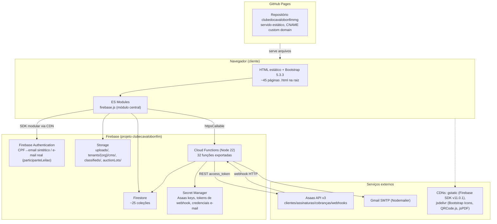
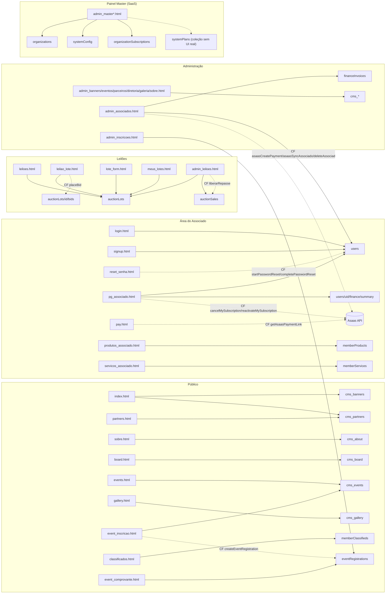

# Arquitetura

## 1. Arquitetura geral

**Resumo**: não há servidor de aplicação tradicional. O navegador fala diretamente com Firebase (Auth/Firestore/Storage) usando o SDK modular do Firebase v11.0.1 carregado via CDN `gstatic.com`. O único backend é um conjunto de Cloud Functions (Node.js 22, 1ª geração da API `firebase-functions@4.9`) que concentra: (a) tudo que envolve segredos (chave Asaas, credenciais de e-mail), (b) tudo que precisa ser atômico/confiável (transação de lance, exclusão de conta, troca de senha), e (c) toda comunicação com o Asaas. O GitHub Pages serve apenas arquivos estáticos — não há SSR, não há build step (confirmado: nenhum `webpack`/`vite`/`bundler` no `package.json` raiz, que só declara scripts de teste e2e).

## 2. Fluxo Frontend

Todas as páginas seguem o mesmo esqueleto:

1. `<head>`: Bootstrap CSS local (`assets/css/bootstrap.min.css`), Bootstrap Icons via CDN jsdelivr, `assets/css/design-system.css` (design tokens/componentes `ds-*`), `assets/css/custom.css` (sticky footer).
2. `<body>`: navbar/menu com `data-module="X"` em itens condicionados a módulos; conteúdo estático de fallback; footer.
3. `<script type="module">`: importa `./firebase.js` (relativo) e, conforme a página, módulos adicionais direto do CDN Firebase (`firebase-app.js`, `firebase-auth.js`, `firebase-firestore.js`, `firebase-functions.js`).
4. `assets/js/bootstrap.bundle.min.js` (JS do Bootstrap) e `assets/js/main.js` (**stub vazio**, `// static helpers` — não implementa nada hoje) carregados como scripts clássicos no fim do `<body>`.

`firebase.js` é o único módulo central (648 linhas) e expõe: inicialização do app, `auth`/`db`/`storage`, `currentOrgId`, autenticação (`doLogin`, `doSignupWithProfile`, `doSignupParticipanteLeilao`, `requireAuth`, `doLogout`), leitura de perfil/status (`getUserProfile`, `getUserStatus`), CRUD simples de produtos/serviços, compressão/upload de imagem (`compressImage`, `uploadImageFile`), multi-tenant (`checkModuleEnabled`, `applyModuleVisibility`, `logAction`), e utilidades de UI (`setupAdminButton`, atualização automática do botão de navbar `#btnAssociado`).

**Padrão "estático + CMS"**: páginas institucionais (`sobre.html`, `board.html`, `partners.html`, `events.html`, `gallery.html`, `index.html`) têm conteúdo HTML hardcoded como fallback visual, sobrescrito em runtime por um `getDocs`/`getDoc` às coleções `cms_*` filtradas por `orgId==currentOrgId`. Só `classificados.html` e as páginas de leilão usam `onSnapshot` (tempo real); as demais usam busca única (`getDocs`/`getDoc`).

## 3. Fluxo Backend (Cloud Functions)

`functions/index.js` (3421 linhas, Node 22) exporta 32 funções, divididas em:

| Grupo | Funções |
|---|---|
| Relatórios/cron | `sendDailyPaymentReport` (08:00 BRT), `asaasReconciliationDaily` (04:00 BRT), `encerrarLotesExpirados` (a cada 1 min), `verificarInadimplentesDiarios` (09:00 BRT) |
| Ciclo de vida do associado × Asaas | `onNewAssociadoCriado`, `onAssociadoAtualizado`, `onInvoicePaid`, `onInvoiceCreatedPaid` (triggers Firestore) |
| Ações administrativas Asaas | `syncAllAssociadosToAsaas`, `createAsaasSubscriptions`, `configureAsaasNotifications`, `listAsaasCustomersRaw`, `verifyAsaasNotificationStandard`, `fixAsaasPhoneNumbers`, `asaasSyncAssociado`, `asaasCreatePayment`, `asaasCancelPayment`, `asaasGetPaymentStatus` |
| Self-service do associado | `getAsaasPaymentLink`, `cancelMySubscription`, `reactivateMySubscription` |
| Webhook | `asaasWebhook` (mensalidades), `auctionAsaasWebhook` (leilões) |
| Conta/senha | `resetUserPassword` (master), `startPasswordReset`, `completePasswordReset`, `deleteAssociado` (master) |
| Auditoria | `auditCpfs`, `auditAsaasSync` |
| Leilões | `placeBid`, `gerarCobrancaLeilao`, `liberarRepasse`, `onSaleCreated` (trigger) |
| Eventos | `createEventRegistration`, `confirmEventCheckin` |

Ver detalhamento função a função em [ASAAS.md](ASAAS.md) e [FLOWS.md](FLOWS.md). Todas as credenciais sensíveis (chave Asaas, tokens de webhook, usuário/senha de e-mail) vêm exclusivamente do **Google Secret Manager** via helper `getSecret()` — nenhum segredo em `process.env` ou hardcoded.

## 4. Fluxo Firebase (visão de produto)

- **Auth**: usuários de associados usam e-mail sintético `{cpf}@cpf.local`; participantes de leilão usam e-mail real; o painel master usa e-mail real de administradores da Serafim Technologies.
- **Firestore**: banco de documentos único, sem esquema forçado — validação existe apenas nas Security Rules e nas Cloud Functions.
- **Storage**: apenas imagens (produtos, serviços, classificados, CMS, lotes de leilão), com compressão client-side antes do upload.
- **Cloud Functions**: única camada de confiança para operações sensíveis.

## 5. Fluxo Asaas

Ver [ASAAS.md](ASAAS.md) — inclui os dois webhooks distintos (mensalidade e leilão), tokens diferentes, e o padrão de idempotência baseado em `asaasPaymentId`.

## 6. Fluxo Authentication

Ver [AUTHENTICATION.md](AUTHENTICATION.md).

## 7. Fluxo Firestore / 8. Fluxo Storage

Ver [FIRESTORE.md](FIRESTORE.md) e [STORAGE.md](STORAGE.md) para as regras completas; [DATABASE.md](DATABASE.md) para o schema de dados.

## 9-21. Demais fluxos específicos

Todos os fluxos solicitados (pagamento, login, cadastro, cancelamento, renovação, administrativo, classificados, produtos, serviços, imagens/upload, notificações, sincronização Asaas, webhooks) estão detalhados com diagramas Mermaid em [FLOWS.md](FLOWS.md) e descritos funcionalmente em [FEATURES.md](FEATURES.md)/[ADMIN.md](ADMIN.md).

## Diagrama: mapa de módulos e coleções

## Nota de atualização (Fase 3.6) — a relação de confiança abaixo inverteu

Esta seção originalmente instruía o leitor a tratar `CLAUDE.md` como desatualizado frente a este `docs/`. Isso deixou de ser verdade: este arquivo (e o resto de `docs/`) foi gerado por uma leitura completa do código em **2026-07-21** (ver [README.md](README.md)) e nunca foi reconciliado desde então — não cobre nenhuma das Fases 2B em diante (Painel Master reconstruído em `portal-associativo/admin/`, administração de plataforma, provisionamento automático de organizações, configuração por organização, identidade do tenant/domínios, hardening da Fase 3.6). **`CLAUDE.md`, na raiz do repositório, é a fonte de verdade atual** — histórico completo de fases, schema do Firestore, Cloud Functions e Firestore Rules em vigor. Use este `docs/` como material de referência histórico sobre o estado do sistema em 2026-07-21, não como descrição do sistema hoje.
