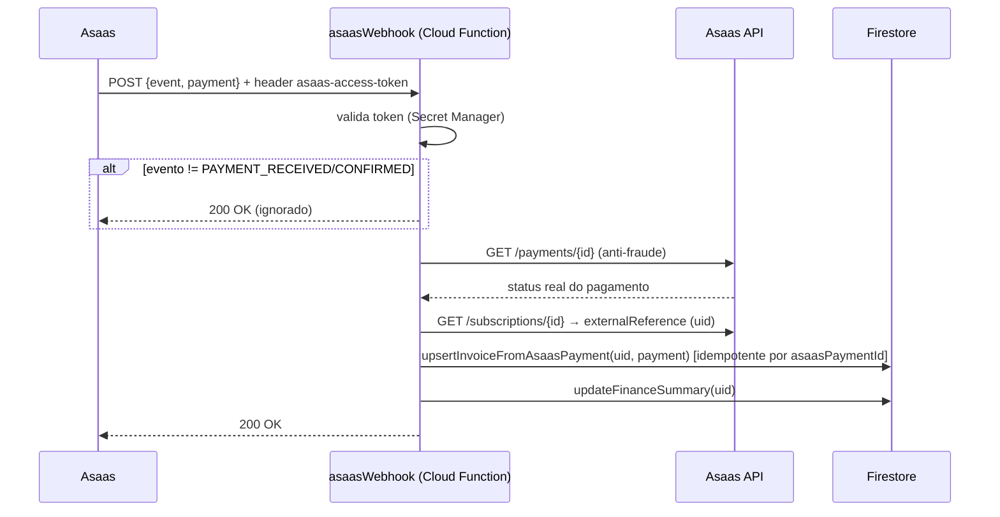

# Integração Asaas

**API**: `https://api.asaas.com/v3` (produção — não sandbox). Autenticação em toda chamada via header `access_token: <apiKey>` (não `Authorization: Bearer`). Chave obtida via Secret Manager (`getAsaasApiKey()` → `getSecret(ASAAS_SECRET)`).

## Planos e valores (anuidade de associado)

| `planType` | Ciclo Asaas | Valor (`PLAN_VALUE`) | Observação |
|---|---|---|---|
| `mensal` | MONTHLY | R$ 30 | — |
| `trimestral` | QUARTERLY | R$ 85 | — |
| `semestral` | SEMIANNUALLY | R$ 170 | — |
| (qualquer, associado Mirim) | igual ao plano do responsável | 50% do valor acima | `resolvePlanValue()` divide por 2 quando `categoriaAssociado==="mirim"` |

Assinatura criada com `billingType: UNDEFINED` (associado escolhe PIX/boleto/cartão no checkout hospedado do Asaas), `interest.value: 0.01`, `notificationEnabled: true`, `externalReference: uid` (vínculo com o Firebase).

## Clientes (customers)

`findOrCreateAsaasCustomer(apiKey, user)` (`functions/index.js:947`) — busca em cascata: 1) por `externalReference` (uid), 2) por `cpfCnpj` (só não-mirim), 3) cria novo. Campos enviados: `name`, `cpfCnpj`, `mobilePhone` (formatado sem prefixo 55 via `formatPhoneForAsaas`), `externalReference`. Usado por: `onNewAssociadoCriado`, `syncAllAssociadosToAsaas`, `gerarCobrancaLeilao`, `onSaleCreated`.

## Assinaturas (subscriptions)

Criadas por `onNewAssociadoCriado` (trigger, na criação do usuário) ou `createAsaasSubscriptions` (callable, em massa, para quem já tem `asaasId` mas não `asaasSubscriptionId`). Pausadas/reativadas via `POST /subscriptions/{id}` com `{status: INACTIVE|ACTIVE}` em 4 pontos: `onAssociadoAtualizado` (quando `ativo` muda), `cancelMySubscription`, `reactivateMySubscription`. Canceladas definitivamente (`DELETE /subscriptions/{id}`) só em `deleteAssociado`.

## Cobranças (payments)

- Avulsas: `asaasCreatePayment` (admin, "Gerar cobrança"), `createImmediateChargeOnReactivation` (auto, ao reativar), `gerarCobrancaLeilao` (comprador de lote de leilão).
- Consulta de cobrança pendente do próprio associado: `getAsaasPaymentLink` (usado por `pay.html`) — tenta `PENDING` depois `OVERDUE`, retorna o link de checkout hospedado do Asaas (`invoiceUrl`) para redirect externo (a página nunca processa cartão/PIX diretamente).
- Baixa manual: `syncManualPaymentToAsaas` — quando o admin marca uma fatura como paga sem `asaasPaymentId`, localiza a cobrança correspondente no Asaas (por `dueDate`) e chama `POST /payments/{id}/receiveInCash`.
- Cancelamento: `asaasCancelPayment` (admin), `cancelOpenPayments` (interno, cancela todas PENDING/OVERDUE do cliente ao desativar/cancelar).

## Webhooks

Dois endpoints HTTP públicos e independentes, com **tokens diferentes**:

| Função | Endpoint | Token (Secret Manager) | Reflete em |
|---|---|---|---|
| `asaasWebhook` | `https://us-central1-clubecavalobonfim.cloudfunctions.net/asaasWebhook` | `ASAAS_WEBHOOK_TOKEN` | `users/{uid}/financeInvoices` + `finance/summary` |
| `auctionAsaasWebhook` | endpoint próprio (leilões) | `ASAAS_AUCTION_WEBHOOK_TOKEN` | `auctionPayments` + `auctionSales.status` |

Ambos seguem o mesmo padrão: validam header `asaas-access-token` → aceitam só `PAYMENT_RECEIVED`/`PAYMENT_CONFIRMED` (outros eventos retornam 200 sem ação, evitando retry infinito) → **reconsultam a API Asaas diretamente** (`GET /payments/{id}`) antes de confiar no payload (anti-fraude contra payload forjado) → resolvem o dono (uid via `subscription.externalReference`, ou saleId via `payment.externalReference`) → aplicam de forma idempotente (chave `asaasPaymentId`) → recalculam o estado agregado (`finance/summary` ou `auctionSales.status`).

## Sincronização (reconciliação)

- **Automática, diária, silenciosa**: `asaasReconciliationDaily` (04:00 BRT) — para todo associado com `asaasId`+`asaasSubscriptionId`+ativo, chama `syncOneAssociado(uid,{manual:false})`: busca assinatura + últimos 10 pagamentos, faz upsert dos efetivamente `RECEIVED`/`CONFIRMED`/`RECEIVED_IN_CASH`, atualiza `finance/summary`. Escopo estritamente leitura/reconciliação — nunca cria/cancela cobrança.
- **Manual, sob demanda**: `asaasSyncAssociado` (botão "Atualizar dados" em `admin_associados.html`) — mesma lógica, `manual:true`, grava trilha extra em `users/{uid}.asaasSync`.
- **Em massa** (uso pontual, `admin.html`): `syncAllAssociadosToAsaas` (cria clientes faltantes), `createAsaasSubscriptions` (cria assinaturas faltantes), `configureAsaasNotifications` (aplica padrão de notificação a todos os clientes Asaas cadastrados, mesmo os sem uid Firebase correspondente).
- **Diagnóstico/auditoria**: `listAsaasCustomersRaw`, `verifyAsaasNotificationStandard`, `auditAsaasSync`, `auditCpfs`.

## Notificações (WhatsApp/SMS)

`syncCustomerNotifications()` aplica o "padrão institucional": WhatsApp e SMS habilitados, e-mail e ligação desabilitados, via `PUT /notifications/batch`, com fallback dinâmico para eventos que rejeitam WhatsApp (ex.: `SEND_LINHA_DIGITAVEL`, tratado num `Set` de exceções conhecidas). `setCustomerNotificationsEnabled(enabled)` liga/desliga tudo de uma vez (usado na desativação/reativação). Notificações reais (SMS/WhatsApp de vencimento -5d/0/+5d) são disparadas pelo próprio Asaas, não pelo backend do clube — o backend só **configura** os canais.

## Cancelamento e reativação (self-service)

Ver detalhamento completo em [FLOWS.md](FLOWS.md) e [AUTHENTICATION.md](AUTHENTICATION.md). Resumo do desenho: `cancelMySubscription` pausa a assinatura no Asaas e cancela cobranças em aberto, mas **não** grava `ativo:false` (reservado para desativação administrativa) — o associado mantém acesso normal até `finance/summary.activeUntil` vencer. `reactivateMySubscription` reverte tudo e gera uma cobrança avulsa imediata.

## Tratamento de erros

- Padrão geral: try/catch amplo em toda função; falhas em ações secundárias (e-mail, trilha de auditoria) nunca bloqueiam o fluxo principal (`notifyAdminsByEmail` usa `Promise.race` com timeout de 5s).
- `onNewAssociadoCriado`/`onAssociadoAtualizado` (triggers Firestore): erros são apenas logados (`console.error`), nunca relançados — não podem bloquear a escrita do documento que os disparou.
- Webhooks: exceção não tratada → HTTP 500 → Asaas reenvia automaticamente (comportamento nativo de retry do Asaas).

## Estratégia de reconciliação (resumo)

Camadas redundantes, da mais imediata à mais lenta: (1) webhook em tempo real → (2) sincronização manual sob demanda pelo admin → (3) reconciliação automática diária (madrugada) como rede de segurança contra webhooks perdidos/falhos. Todas convergem no mesmo helper `upsertInvoiceFromAsaasPayment`, garantindo que o resultado final seja idempotente independente de qual camada processou primeiro.

## Módulo de Leilões × Asaas

Fluxo paralelo e independente do de mensalidades: `gerarCobrancaLeilao` (cria cliente Asaas do comprador se necessário + cobrança avulsa vencendo em 5 dias, `externalReference: saleId`) → `auctionAsaasWebhook` (confirma pagamento, marca `auctionPayments`/`auctionSales` como `pago`) → `liberarRepasse` (admin libera o valor líquido ao vendedor, comissão de 10% já descontada — 5% clube + 5% "sistema"/plataforma). **Achado**: não existe nenhum botão de UI que chame `gerarCobrancaLeilao` — o comprador do lote arrematado não tem, hoje, como gerar a própria cobrança pela interface (ver [TECH_DEBT.md](TECH_DEBT.md)).
