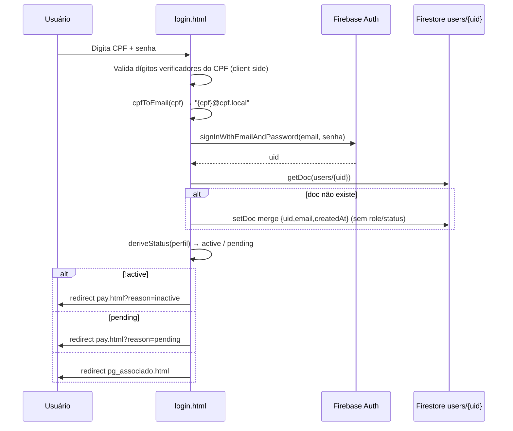

# Firebase Authentication

## Modelo de identidade

O sistema usa **três padrões de identidade** sobre o mesmo projeto Firebase Auth:

1. **Associado (padrão)**: e-mail sintético `{11 dígitos do CPF}@cpf.local`, gerado por `cpfToEmail()` (`firebase.js:67-70`). O usuário nunca vê nem digita esse "e-mail" — apenas o CPF.
2. **Participante de Leilão**: e-mail **real** informado no cadastro (`doSignupParticipanteLeilao`, `firebase.js:187-208`) — esse papel não usa a convenção CPF→email porque não é considerado "associado".
3. **Master (Serafim Technologies)**: e-mail real de administrador da plataforma, autenticado em `login_master.html`, que roda uma **instância própria e isolada do Firebase App** (config inline duplicada, não reaproveita `firebase.js`).

`setPersistence(auth, browserLocalPersistence)` é configurado ao carregar `firebase.js` (linha 62-63) — sessão persiste entre abas/reload do navegador até logout explícito.

## Mapeamento de papéis (role)

`mapRole()` (`firebase.js:80-88`, espelhado no backend por `mapRoleServer()`, `functions/index.js:15-22`) normaliza (remove acento, minúsculo, trim) e reduz qualquer string de `role` a um destes 6 valores:

| Valor final | Regra de matching |
|---|---|
| `master` | contém "master" |
| `adminView` | contém "admin" **e** "view" |
| `admin` | contém "admin" (e não "view") |
| `operador` | contém "operador" |
| `participanteLeilao` | contém "participante" |
| `associado` | default (qualquer outra coisa, incluindo vazio) |

Essa normalização tolera erros de digitação/capitalização no Firestore (`"Admin"`, `"ADMIN "`, `"Admin View"` etc. resolvem corretamente).

## Cache de sessão

`sessionStorage` guarda a role já resolvida (`ROLE_KEY = "userRole"`, `firebase.js:91-97`) para evitar reconsultar o Firestore a cada navegação de página — expira ao fechar a aba (não é `localStorage`). `requireAuth()` só busca a role no Firestore se o cache estiver vazio ou for `"associado"` (fail-open para o caso default, forçando reconfirmação).

Também há cache de módulos habilitados por organização (`modules_{orgId}`, TTL 10 minutos, `firebase.js:369-382`) usado por `checkModuleEnabled`.

## Guarda de rota — `requireAuth(options)`

`firebase.js:211-250`. Assina `onAuthStateChanged`; se não há usuário, redireciona para `loginUrl` (default `./login.html`); se há `requiredRole`, compara a role resolvida (normalizada) contra a lista aceita — se não bater, redireciona para `./index.html`. Se a role for `adminView`, injeta um banner fixo no topo da página ("Acesso somente leitura — Admin View") e adiciona a classe `admin-view-mode` ao `<body>` (que o CSS `design-system.css` usa para ocultar botões de ação, ver §613 de `assets/css/design-system.css`).

**Nem todas as páginas usam este guard.** `login.html`, `login_master.html`, `pay.html`, `pg_associado.html`, `produtos_associado.html`, `servicos_associado.html` implementam sua própria checagem inline via `onAuthStateChanged` — funcionalmente equivalente, mas duplicada (ver [TECH_DEBT.md](TECH_DEBT.md)). As páginas administrativas (`admin*.html`) e `event_checkin.html`/`lote_form.html`/`meus_lotes.html` usam `requireAuth` de fato.

## Fluxo de login (associado, `login.html`)

`deriveStatus()` (`login.html:211-221`) normaliza `status`/`situacao`/`sit` e deriva `pending` (regex `/pend/` ou flags booleanas legadas) e `active` (não é `pend|inativ|suspens|bloquead`, e respeita `isActive`/`ativo` se presentes).

## Fluxo de cadastro (`signup.html`)

Dois formulários alternáveis por rádio:

- **Associado**: CPF + senha (≥6) + nome/telefone/endereço → `doSignupWithProfile()` (`firebase.js:163-183`) cria conta Auth com e-mail sintético, grava `users/{uid}` (`role:"associado", status:"Anuidade Pendente", ativo:true`), redireciona para `pay.html`. A definição do plano (mensal/trimestral/semestral) **não ocorre nesta tela** — é decidida depois pela diretoria/admin ao configurar a assinatura Asaas.
- **Participante de Leilão** (só visível se módulo `leiloes` ativo): CPF + e-mail real + senha + aceite obrigatório dos Termos do Comprador → `doSignupParticipanteLeilao()` (`firebase.js:187-208`), `role:"participanteLeilao"`, redireciona para `leiloes.html`.

## Fluxo de redefinição de senha self-service (SMS / Firebase Phone Auth)

Feature mais recente do repositório (`reset_senha.html`, commit `b30a76f8`). Ver diagrama completo em [FLOWS.md](FLOWS.md)#redefinição-de-senha. Resumo do mecanismo de segurança: a barreira real não é o CPF nem o código digitado, é o **claim `phone_number` assinado pelo Firebase** após `confirmationResult.confirm(code)` — a Cloud Function `completePasswordReset` (`functions/index.js:2514-2560`) compara esse claim (não falsificável pelo cliente) com o telefone cadastrado no perfil, e só então troca a senha via Admin SDK. Rate-limit de 5 tentativas/hora por CPF (`checkAndIncrementResetAttempts`, `functions/index.js:2450-2471`, transação sobre `passwordResetAttempts/{cpf}`).

## Primeiro acesso (`primeiroAcesso`)

Quando o admin cria um associado com senha provisória (`resetUserPassword`, master) ou quando `completePasswordReset` roda, o backend grava `primeiroAcesso:true`/`false`. Em `pg_associado.html`, se `true`, um modal de troca de senha obrigatória é aberto de forma inescapável (`data-bs-backdrop="static"`, `data-bs-keyboard="false"`, botão fechar oculto) — a única saída é trocar a senha ou clicar "Sair" (logout). Ao trocar com sucesso, `primeiroAcesso` volta a `false` e o modal se torna um modal comum de troca de senha voluntária.

## Papéis e onde são concedidos/checados

| Role | Concedido em | Checado em |
|---|---|---|
| `master` | `admin_associados.html` (campo role, restrito), Firestore direto | `login_master.html`, todas as páginas `admin_master*.html`, `resetUserPassword`/`deleteAssociado` (Cloud Functions), `firestore.rules` (`isMaster()`) |
| `admin` / `Admin View` | `admin_associados.html` | Todas as páginas `admin_*.html` (exceto master), `canOperate()` nas regras (`adminView` cai em "associado" nas regras server-side — ver achado de inconsistência em [SECURITY.md](SECURITY.md)) |
| `operador` | Definido no mapeamento mas não atribuído/usado por nenhuma tela lida — papel "morto" hoje |
| `participanteLeilao` | `doSignupParticipanteLeilao` | Pode dar lances (`placeBid`); explicitamente excluído de cadastrar lotes (`lote_form.html`, `meus_lotes.html`) e de `isAssociadoOrAdmin()` nas regras |
| `associado` | Default no cadastro | Área do associado, cadastro/gestão de lotes de leilão, classificados |

## Sessões e persistência

- `browserLocalPersistence` (Firebase Auth) — sobrevive a fechar/reabrir o navegador.
- `sessionStorage` para cache de role e módulos — não sobrevive a fechar a aba (mas sobrevive a navegação/reload da mesma aba).
- Logout (`doLogout()`, `firebase.js:253-258`): `signOut` + limpa cache de role + redireciona para `login.html?logout=1` (o parâmetro força reavaliação mesmo que a persistência ainda entregue um usuário no primeiro instante).

## Google Login

Não encontrado no código — não há `GoogleAuthProvider`/`signInWithPopup` em nenhum arquivo lido. O item "Google Login" citado no escopo genérico de tarefas de documentação **não se aplica** a este projeto.
