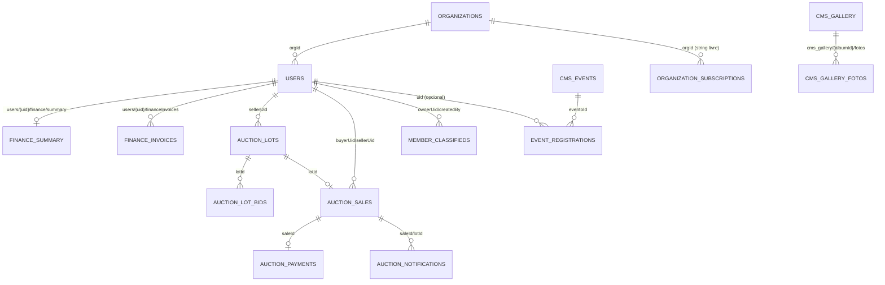

# Banco de Dados (Firestore)

> **Nota de escopo (agosto de 2026)**: levantamento de 2026-07-21, portanto anterior às coleções de plataforma (`platformAdmins`, `provisioningRuns`, `domains`, `featureFlags`, `organizations/{orgId}/public/branding`) e aos campos de `organizations/{orgId}` adicionados nas Fases 3.3–3.12/4 (`billing.*`, `business.*`, `isSandbox` etc.). Schema completo e atual em `CLAUDE.md` (raiz deste repositório), seção "Firestore Schema".

Firestore é um banco de documentos sem esquema forçado — os campos abaixo foram extraídos da leitura de todo código que grava/lê cada coleção (frontend + Cloud Functions), não de um schema declarado. Tipos e obrigatoriedade são inferidos do uso real.

## Diagrama de relacionamento (visão lógica)

## Convenções transversais

- **Multi-tenant**: quase toda coleção de conteúdo/negócio grava `orgId` e é filtrada por `where("orgId","==",currentOrgId)`. `currentOrgId` é fixo em `"org_bonfim"` (`firebase.js:56`).
- **Soft delete**: coleções `cms_*` usam `deleted: boolean` (nunca removidas fisicamente). `memberProducts`/`memberServices`/`memberClassifieds` usam apenas `active: boolean` (sem exclusão possível pela UI). `users` é excluído fisicamente (irreversível) só pela function `deleteAssociado` (master).
- **Auditoria**: `createdAt`/`updatedAt` (Firestore `serverTimestamp()`) em quase todos os documentos; ações administrativas de CMS/leilão/organização também gravam em `systemLogs` via `logAction()`.
- **Idempotência financeira**: chave `asaasPaymentId` em `financeInvoices` e `auctionPayments`.

---

## `users/{uid}`

Coleção central — perfil de associado, admin, master, operador ou participante de leilão.

| Campo | Tipo | Obrigatório | Origem/gravado por | Descrição |
|---|---|---|---|---|
| `cpf` | string (dígitos) | associado/mirim | signup, admin | CPF sem máscara |
| `email` | string | sim | signup/criação | `{cpf}@cpf.local` (associado) ou e-mail real (participanteLeilao, master) |
| `nome` | string | sim | signup, admin | Nome completo |
| `apelido` | string | não | admin | Nome de exibição curto |
| `telefone` | string | sim (exceto mirim s/conta) | signup, admin | Usado para Asaas (SMS/WhatsApp) e reset de senha por SMS |
| `endereco` | string | não | signup, admin | Endereço completo |
| `role` | string | sim | signup (`"associado"`), admin | `master`\|`admin`\|`Admin View`/`adminView`\|`operador`\|`participanteLeilao`\|`associado` (normalizado por `mapRole`/`mapRoleServer`) |
| `status` | string | não | signup (`"Anuidade Pendente"`), admin | Texto livre; normalizado por regex (`pend`, `inativ`, `suspens`, `bloquead`) para deduzir `active`/`pending` |
| `ativo` | boolean | sim | signup (`true`), admin | `false` = desativação administrativa, bloqueia login imediatamente |
| `orgId` | string | sim | signup, admin | Tenant — sempre `"org_bonfim"` hoje |
| `primeiroAcesso` | boolean | quando aplicável | admin (`resetUserPassword`), `completePasswordReset` | Força modal de troca de senha obrigatória em `pg_associado.html` |
| `planType` | string | não | admin, `createAsaasSubscriptions` | `mensal`\|`trimestral`\|`semestral` |
| `categoriaAssociado` | string | não | admin | `"mirim"` = sem conta própria, cobrado no CPF do responsável, 50% do valor |
| `responsavelNome`/`responsavelCpf`/`responsavelTelefone` | string | se mirim | admin | Dados do responsável financeiro do associado Mirim |
| `inadimplenteLeilao` | boolean | participantes de leilão | `verificarInadimplentesDiarios`, admin (`admin_leiloes.html`) | Bloqueia `placeBid` |
| `desativadoEm`/`desativadoPor` | Timestamp/uid | quando desativado | admin (`admin_associados.html`) | Auditoria da desativação administrativa |
| `notaDesativacao` | string | não | admin | Motivo textual |
| `assinaturaCanceladaEm` | Timestamp | quando autocancelado | `cancelMySubscription` | Timestamp do autocancelamento |
| `assinaturaCanceladaPeloAssociado` | boolean | quando autocancelado | `cancelMySubscription`/`reactivateMySubscription` | Distingue autocancelamento de desativação admin |
| `asaasId` | string | após 1ª sync | `findOrCreateAsaasCustomer` (trigger/callable) | ID do cliente no Asaas |
| `asaasSyncedAt` | Timestamp | idem | idem | — |
| `asaasSubscriptionId` | string | após criar assinatura | `onNewAssociadoCriado`/`createAsaasSubscriptions` | ID da assinatura Asaas |
| `asaasSubscriptionSyncedAt` | Timestamp | idem | idem | — |
| `asaasSync` | map | não | vários triggers/callables | `{lastSyncedAt, lastSyncResult, lastSyncError, lastApiCheckAt, lastApiCheckStatus, lastWebhookAt, lastWebhookEvent, lastLifecycle*}` — trilha de auditoria consumida pela aba "Auditoria" de `admin_associados.html` |
| `cidade`/`estado` | string | participanteLeilao | `doSignupParticipanteLeilao` | — |
| `isActive`/`situacao`/`sit`/`pendenciasFinanceiras`/`hasPendingPayments`/`pendingPayments`/`pendencias` | vários | legado | — | Campos alternativos lidos por `getUserStatus`/`deriveStatus` por compatibilidade histórica |
| `createdAt`/`updatedAt` | Timestamp | sim | — | — |

**Subcoleções de `users/{uid}`:**

### `users/{uid}/finance/summary` (documento único, id fixo `"summary"`)
| Campo | Tipo | Descrição |
|---|---|---|
| `lastPayment` | Timestamp\|null | Data do último pagamento confirmado |
| `lastAmount` | number\|null | Valor do último pagamento |
| `nextDue` | string (YYYY-MM-DD) ou Timestamp | Próximo vencimento |
| `activeUntil` | Timestamp/string | Vigência paga (usada para liberar acesso mesmo após autocancelamento) |
| `exempt` | boolean | Isenção de cobrança (aba Financeiro do admin) |
| `exemptUntil` | Timestamp\|null | Validade da isenção |
| `balance` | number | Saldo devedor (se >0, `getUserStatus` marca `pending:true`) |
| `subscriptionStatus` | string | `ACTIVE`/`INACTIVE` (espelho do Asaas, via `syncOneAssociado`) |
| `subscriptionValue`/`subscriptionCycle`/`subscriptionBillingType`/`subscriptionNextDueDate` | vários | Espelho da assinatura Asaas |
| `notif` | map | `{configured, whatsapp, sms, email, checkedAt}` — status de notificações Asaas |
| `updatedAt` | Timestamp | — |

### `users/{uid}/financeInvoices/{invoiceId}`
| Campo | Tipo | Descrição |
|---|---|---|
| `planType` | string | mensal/trimestral/semestral/anual/personalizado |
| `planName` | string | Label legível |
| `amount` | number | Valor |
| `status` | string | `pago`\|`em_aberto`\|`atrasado`\|`cancelado`\|`pendente` |
| `paidAt` | Timestamp\|null | Data de pagamento |
| `planStart`/`planEnd` | Timestamp | Vigência do plano cobrado |
| `dueDate` | Timestamp | Vencimento (= `planStart` no lançamento manual) |
| `method` | string | Forma de pagamento (registro manual do admin) |
| `notes` | string | Observação livre |
| `recordedByUid`/`recordedByName`/`recordedByCPF` | — | Quem lançou manualmente |
| `recordedAt`/`updatedAt`/`createdAt` | Timestamp | — |
| `asaasPaymentId` | string | **Chave de idempotência** com o Asaas (gravado pelo webhook/sync) |
| `billingType` | string | PIX/BOLETO/CREDIT_CARD (do Asaas) |
| `invoiceUrl` | string | Link do boleto/checkout Asaas |
| `gatewayId` | string | Id genérico de gateway (campo legado) |
| `months` | number | Meses cobertos (criação client-side, ver regra `_isInvoiceCreateValid`) |

Regra de criação pelo próprio cliente (`firestore.rules:73-107`) permite `create` **apenas** com os campos `planType, planName, planStart, planEnd, dueDate, amount, status, months, createdAt, recordedAt`, com `status` restrito a `pendente`/`em_aberto` e bloqueando explicitamente `paidAt`, `gatewayId`, `method`, `mp`, `updatedAt` — ou seja, um cliente comprometido não pode se autodeclarar "pago" na criação.

### `users/{uid}/finance/invoices/{invId}` (legado)
Mantido só por compatibilidade nas regras (`firestore.rules:250-253`); não há evidência de uso ativo no código lido — a subcoleção real e atual é `financeInvoices` (nível direto do usuário, não dentro de `finance`).

---

## Catálogo — `memberServices/{docId}`
| Campo | Tipo | Descrição |
|---|---|---|
| `title`, `description`, `benefit` | string | Conteúdo do serviço |
| `imageUrl` | string | Imagem única (helper `addMemberService`) — a UI complementa com `imageUrls[]`/`images[]` via `updateDoc` direto |
| `whatsapp` | string (dígitos) | Contato |
| `active` | boolean | Visibilidade |
| `featured` | boolean | Destaque (carrossel) |
| `orgId` | string | Tenant |
| `createdAt`/`updatedAt` | Timestamp | — |

## Catálogo — `memberProducts/{docId}`
Igual a `memberServices`, mais `imageUrls: string[]` (nativamente array) e `price: number|null`.

## `classificados/{docId}` e `memberClassifieds/{docId}` — duas coleções paralelas de classificados

O sistema mantém **duas coleções de classificados coexistindo**:
- `classificados` — regras próprias (`firestore.rules:173-215`), leitura pública (`get,list: true`), usada pelo helper de compatibilidade e por telas legadas.
- `memberClassifieds` — regras próprias (`firestore.rules:126-168`), é a coleção efetivamente usada por `classificados.html` (listagem pública em tempo real) e `admin_classificados.html` (moderação).

| Campo | Tipo | Descrição |
|---|---|---|
| `title`, `description` | string | Anúncio |
| `price` | number | Valor |
| `whatsapp` | string | Contato do anunciante |
| `imageUrls` | string[] | Até 10 imagens (admin) / 3 (associado) |
| `active` | boolean | Ativo/inativo |
| `approved` | boolean | Moderação (aprovado pelo admin) |
| `reviewed` | boolean | Se já passou por moderação |
| `paymentStatus` | string | `pendente`\|`pago`\|`estornado` — monetização (R$1/dia, mín. 30 dias) |
| `featured`/`destaque`/`isFeatured` | boolean | Nomes alternativos usados em diferentes telas para "destaque" |
| `pricePerDay`, `minDays`, `plannedActiveDays` | number | Regras de monetização informativas gravadas na criação pelo associado |
| `ownerUid`/`createdBy` | uid | Dono — dois nomes de campo aceitos pelas regras |
| `ownerEmail`/`createdByName` | string | Metadado do dono |
| `orgId`, `createdAt`, `updatedAt` | — | — |

## Módulo de Leilões

### `auctionLots/{lotId}`
| Campo | Tipo | Descrição |
|---|---|---|
| `sellerUid`, `sellerEmail`, `sellerName` | — | Vendedor (associado) |
| `category` | string | `animal`\|`genetica`\|`produto` |
| `subcategory` | string | Depende da categoria |
| `title`, `description` | string | — |
| `initialBid` | number | Lance mínimo inicial |
| `lastBid` | number | Maior lance atual |
| `lastBidderUid` | uid | Maior licitante atual |
| `bidCount` | number | Contagem de lances (`increment`) |
| `startTime`/`endTime` | Timestamp | Janela do leilão (ajustável na aprovação; estendida automaticamente por anti-sniper) |
| `imageUrls` | string[] | Até 8 fotos |
| `videoLinks` | string[] | Até 3 links YouTube/Vimeo |
| `extraData` | map | Campos dinâmicos por categoria (raça, sexo, idade, registro, pelagem, genealogia, premiações, obsVet / garanhão, condições / tipo, condição, marca, modelo, ano) |
| `cidade`/`estado` | string | Localização |
| `status` | string | `rascunho`→`em_analise`→`publicado`→`encerrado`(+`cancelado`/`rejeitado`) — ver máquina de estados em [FLOWS.md](FLOWS.md) |
| `approvedBy`/`approvedAt` | uid/Timestamp | Aprovação admin |
| `rejectionReason`/`reviewedBy` | string/uid | Rejeição/cancelamento admin |
| `termsAcceptedAt` | Timestamp | Aceite do Termo de Responsabilidade do Vendedor |
| `orgId`, `createdAt`, `updatedAt` | — | — |

Nota: os valores `pago`/`concluido` aparecem em filtros de UI como se fossem estados do **lote**, mas nenhum código gravou esses valores em `auctionLots.status` (quem transiciona para `pago` é `auctionSales.status`) — ver achado em [TECH_DEBT.md](TECH_DEBT.md).

### `auctionLots/{lotId}/bids/{bidId}`
`{bidderUid, amount, placedAt}` — **somente gravável pela Cloud Function `placeBid`** (`allow write: if false` nas regras); leitura para qualquer usuário autenticado.

### `auctionSales/{saleId}`
`{lotId, sellerUid, buyerUid, sellerName, buyerName/Email, finalAmount, commissionClube, commissionSistema, netSeller, status: aguardando_pagamento|pago|repasse_liberado|cancelado, releasedBy, releasedAt, paidAt, orgId, createdAt}` — só gravável por Cloud Functions.

### `auctionPayments/{paymentId}`
`{saleId, buyerUid, asaasPaymentId, status: pendente|pago|vencido, dueDate, value, description, orgId, createdAt}` — só gravável por Cloud Functions.

### `auctionNotifications/{notifId}`
`{recipientUid, type: lote_arrematado|lote_vendido|repasse_liberado|inadimplencia_leilao, message, read, saleId/lotId, createdAt}` — criação/exclusão só por Cloud Functions; usuário só pode marcar `read`.

---

## CMS — `cms_banners`, `cms_events`, `cms_partners`, `cms_board`, `cms_gallery`, `cms_about`

Todas com leitura pública e escrita restrita a admin/master (`firestore.rules:389-428`), padrão de soft delete (`deleted`), e campo `ordem` para posicionamento.

| Coleção | Campos específicos |
|---|---|
| `cms_banners` | `titulo, subtitulo, link, ordem, ativo, imagemUrl` |
| `cms_events` | `titulo, descricao, local, hora, data (Timestamp), valor, linkInscricao, eventoDestaque, imagem, ativo, permiteInscricao, somenteSocioEmDia, dataEncerramento (Timestamp\|null), maxInscritos` |
| `cms_partners` | `nome, categoria, ordem, site, whatsapp, descricao, logo, destaque, ativo` |
| `cms_board` | `nome, cargo, ordem, categoria, telefone, whatsapp, email, descricao, foto, ativo` |
| `cms_gallery` | `titulo, dataEvento, descricao, ativo, coverUrl` + subcoleção `fotos/{fotoId}`: `{fotoUrl, fotoPath, ordem, createdAt}` |
| `cms_about` (documento único, id = `orgId`) | `missao, atividades, beneficios, planosIntro, planosNota, linkAssociacaoTexto, linkAssociacaoUrl, documentos, cnpj, registroCartorio, sede, emailOficial` |

Todas gravam `orgId, createdAt, createdBy, updatedAt, updatedBy, deletedAt, deletedBy` conforme a ação.

## Eventos — `eventRegistrations/{regId}`
| Campo | Tipo | Descrição |
|---|---|---|
| `eventoId` | string | Referência a `cms_events` |
| `cpf`, `nome`, `telefone` | string | Dados do inscrito (não requer conta) |
| `uid` | uid\|null | Preenchido best-effort se CPF casar com um `users` existente |
| `status` | string | `ativo`\|`confirmado`\|`cancelado` |
| `token` | string (UUID) | Usado no QR Code de check-in |
| `viewToken` | string (UUID) | Controle de acesso ao comprovante (`event_comprovante.html`) |
| `confirmedAt`/`confirmedBy` | Timestamp/uid | Check-in |
| `canceledAt`/`canceledBy` | Timestamp/uid | Cancelamento admin |
| `orgId`, `registeredAt` | — | — |

## Multi-tenant / SaaS

### `organizations/{orgId}`
`{nome, slug, cnpj, dominio, telefone, whatsapp, email, site, cidade, estado, cep, endereco, plan: starter|professional|enterprise|custom, ativo, modules: {associados, financeiro, classificados, eventos, parcerias, galeria, diretoria, produtos, servicos, leiloes: boolean}, observacoes, createdAt, updatedAt}`. `id` do documento = slug ou id customizado.

### `systemPlans/{planId}`
Protegida nas regras (`firestore.rules:364-367`) e coberta por teste e2e (`04-migration-data.spec.js`), **mas sem nenhuma tela de CRUD e sem função de seed funcional** — coleção "fantasma" hoje (ver [TECH_DEBT.md](TECH_DEBT.md)).

### `organizationSubscriptions/{subId}`
`{orgId (string livre, sem FK real), plan, valorMensal, status: ativa|inadimplente|cancelada, dataInicio, proximaCobranca, createdAt, updatedAt}` — faturamento SaaS gerido manualmente, sem gateway de pagamento associado.

### `systemConfig/{docId}` (documento fixo `"global"`)
`{nomePlataforma, urlBase, emailPrincipal, emailSecundario, updatedAt}` — campos de projeto Firebase/região/webhooks são somente leitura na UI (hardcoded).

### `systemLogs/{logId}`
`{userId, userEmail, orgId, action, details, timestamp}` — trilha de auditoria (`logAction()`), somente leitura para `master`; criação permitida a qualquer logado desde que `userId == auth.uid`.

## Segurança de senha
### `passwordResetAttempts/{cpf}` (interno, só backend)
Contador transacional de rate-limit (5 tentativas/hora) para `startPasswordReset`. Não é lido/gravado pelo cliente; sem regra explícita nas Firestore Rules lidas (Cloud Functions com Admin SDK ignoram as regras).

---

## Índices compostos (`firestore.indexes.json`)

27 índices definidos, agrupados por coleção: `auctionLots` (7 combinações: por `sellerUid+createdAt`, `status+endTime` asc/desc, `status+createdAt` asc/desc, `orgId+status+createdAt`, `orgId+createdAt`, `orgId+sellerUid+createdAt`), `auctionSales` (2), `auctionPayments` (1), `memberProducts`/`memberServices`/`memberClassifieds` (por `orgId+title`, e um composto rico para `memberClassifieds`: `orgId+active+approved+paymentStatus+createdAt` — o mesmo usado por `watchClassificadosRealtime`), `users` (3: `orgId+nome`, `orgId+role`, `orgId+cpf`), `cms_banners`/`cms_events`/`cms_partners`/`cms_board`/`cms_gallery` (2 cada, com e sem o campo `ativo`), `eventRegistrations` (4, cobrindo listagem por evento+status, por evento+cpf, por uid+orgId).

## Consultas mais relevantes por custo (ver [PERFORMANCE.md](PERFORMANCE.md) para detalhe)

- `classificados.html` — `watchClassificadosRealtime` mantém um listener `onSnapshot` permanente com filtro de 3 campos + 2 `orderBy` — listener persistente = leitura cobrada a cada mudança em qualquer documento que passe pelo filtro, para cada aba aberta.
- `admin_associados.html` — carrega **toda** a coleção `users` da organização de uma vez (sem paginação) para montar os 3 tiers (pendentes/ativos/inativos).
- `gallery.html` — busca a subcoleção `fotos` de cada álbum em loop sequencial (`for...of` com `await` dentro), custo de N+1 leituras onde N = número de álbuns.
