# Fluxos de Negócio (com diagramas Mermaid)

## Novo associado (cadastro → primeira cobrança)

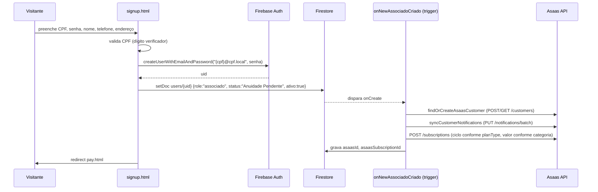

Também é possível o **cadastro pelo admin** (`admin_associados.html`), com os dois subfluxos Normal/Mirim descritos em [ADMIN.md](ADMIN.md) — a criação da assinatura Asaas segue o mesmo trigger `onNewAssociadoCriado`, independente de quem criou o documento `users`.

## Login

Ver diagrama completo em [AUTHENTICATION.md](AUTHENTICATION.md)#fluxo-de-login. Resumo do roteamento pós-login: `!active` → `pay.html?reason=inactive`; `pending` → `pay.html?reason=pending`; caso contrário → `pg_associado.html`.

## Pagamento (associado paga fatura pendente)

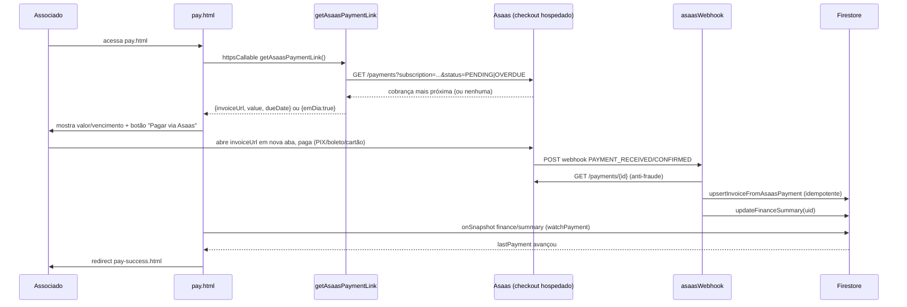

## Renovação (associado próximo do vencimento)

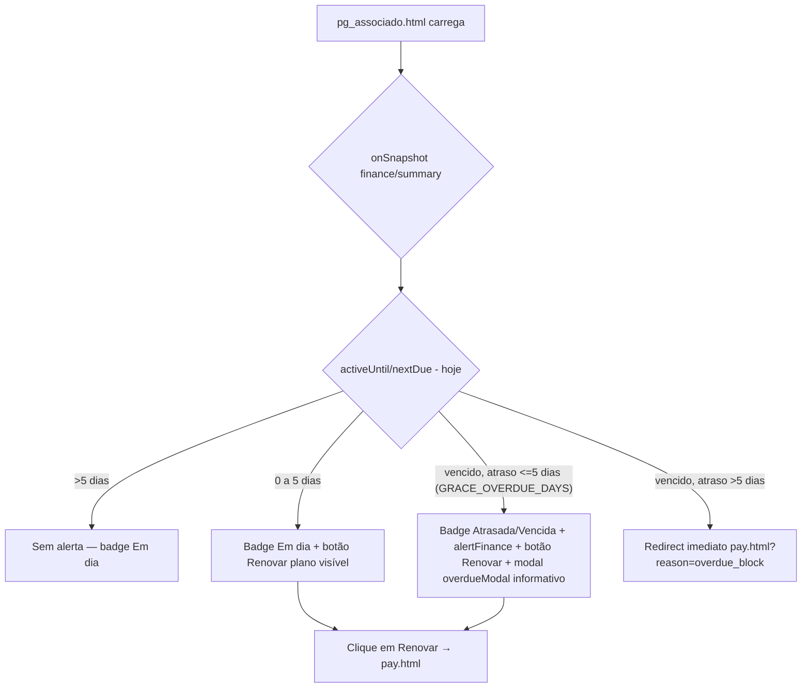

A renovação em si não tem um fluxo de "escolher plano" — o associado é levado a `pay.html`, que busca a cobrança pendente/atrasada já existente no Asaas (gerada automaticamente pelo ciclo da assinatura) e oferece o checkout hospedado.

## Cancelamento de assinatura (self-service)

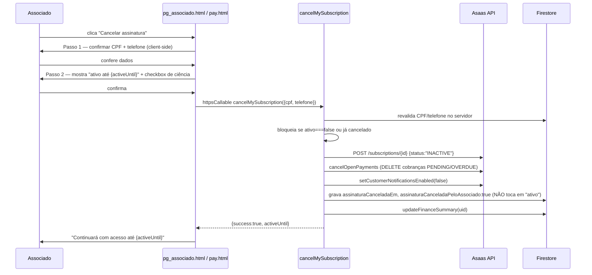

**Reativação** é o inverso: `reactivateMySubscription` reativa a assinatura (`ACTIVE`), religa notificações, gera uma cobrança avulsa imediata (`createImmediateChargeOnReactivation`) e apaga os campos de cancelamento.

## Inadimplência (bloqueio administrativo vs. autocancelamento)

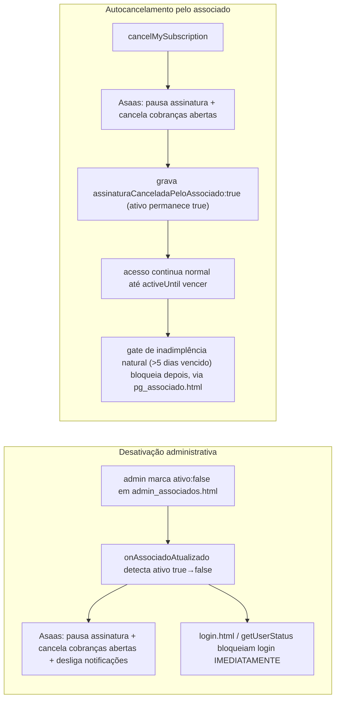

## Fluxo administrativo (visão geral de uma ação típica no painel)

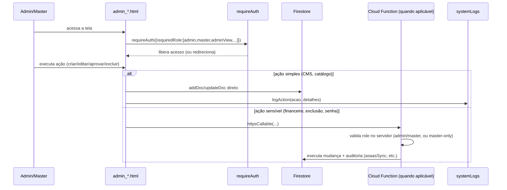

## Publicação de Classificados

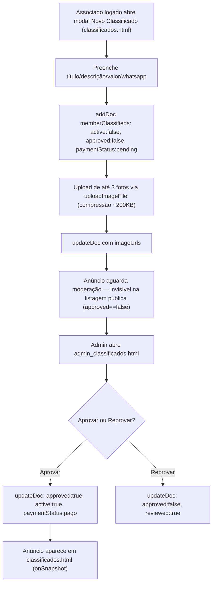

## Upload de imagens (genérico)

Ver diagrama detalhado em [STORAGE.md](STORAGE.md)#fluxo-de-upload. Todos os módulos seguem: selecionar → comprimir (canvas→JPEG, alvo/dimensão variam por módulo) → validar 5MB → `uploadBytesResumable` (path único por timestamp, cache 1 ano) → `getDownloadURL()` → salvar URL no Firestore.

## Webhook (mensalidade e leilão)

Ver [ASAAS.md](ASAAS.md)#webhooks para os dois diagramas completos (`asaasWebhook` e `auctionAsaasWebhook`).

## Sincronização com Asaas

Ver [ASAAS.md](ASAAS.md)#sincronização-reconciliação — 3 camadas (webhook em tempo real, sync manual sob demanda, reconciliação diária automática às 04:00 BRT), todas convergindo em `upsertInvoiceFromAsaasPayment`.

## Máquina de estados — Lote de Leilão

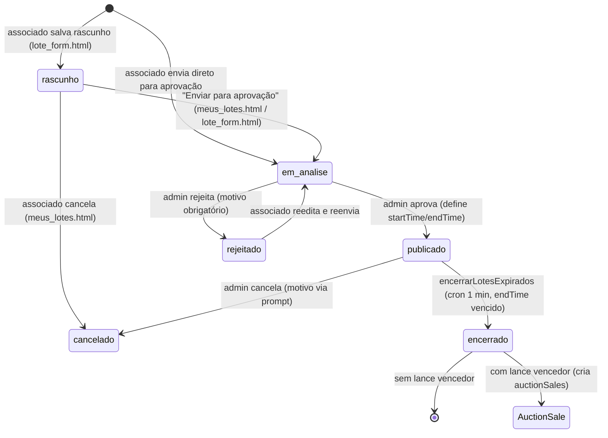

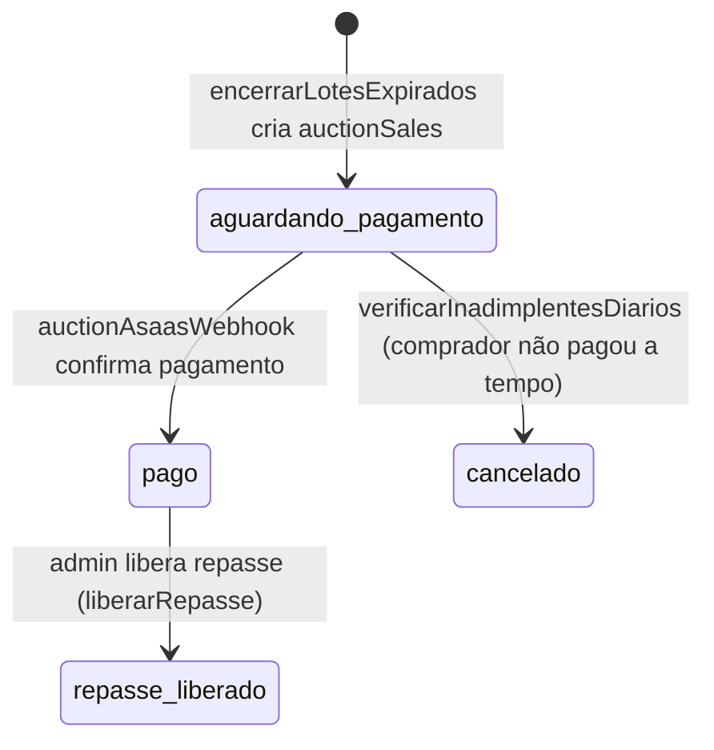

**Nota**: o valor `concluido`, presente em filtros de UI de várias telas como se fosse um estado possível (do lote ou da venda), **nunca é gravado** por nenhum código lido no repositório — é um estado terminal previsto na interface mas não alcançado por nenhum fluxo automatizado hoje (ver [TECH_DEBT.md](TECH_DEBT.md)).

## Redefinição de senha (self-service via SMS)

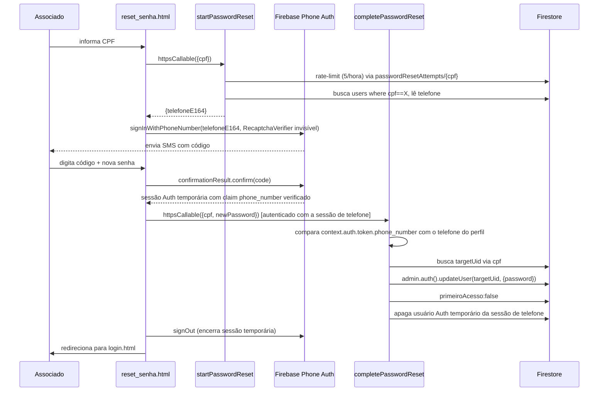

## Fluxo de check-in de evento (ponta a ponta)

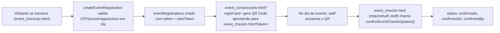
