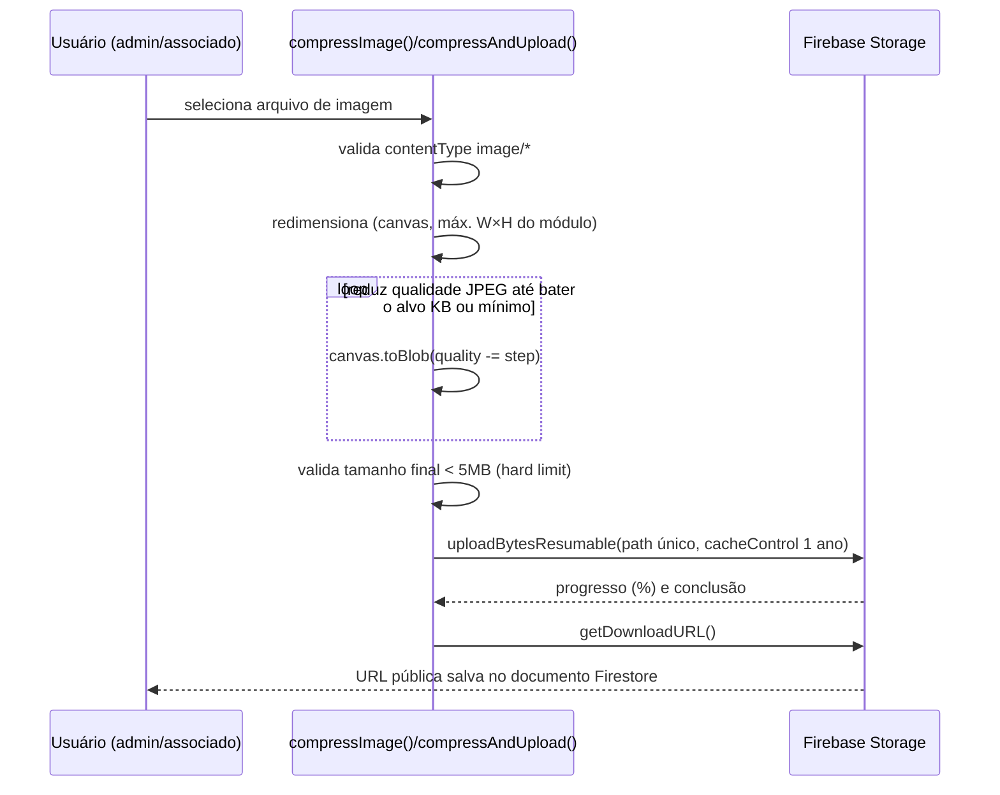

# Firebase Storage — Regras e Convenções de Upload

Arquivo: `storage.rules` (58 linhas, `rules_version = '2'`).

## Helpers
- `isSignedIn()` — `request.auth != null`.
- `isImage()` — `request.resource.size < 5MB` e `contentType` casa com `image/.*`. Aplicado em toda regra de escrita — **o hard-limit de 5 MB é reforçado em duas camadas**: aqui e em `uploadImageFile()` (`firebase.js:582-584`, que já rejeita client-side antes mesmo de tentar o upload).

## Paths e regras por convenção

| Path | Leitura | Escrita | Usado por |
|---|---|---|---|
| `uploads/{category}/{fileName}` (`category` ∈ `products`,`services`,`classifieds`) | pública | logado + imagem | `admin_produtos.html`, `admin_servicos.html`, `admin_classificados.html` |
| `classifieds/{uid}/{docId}/{fileName}` | pública | só o próprio `uid` + imagem | `classificados.html` (upload pelo associado no cadastro público) |
| `products/{uid}/{docId}/{fileName}` | pública | só o próprio `uid` + imagem | Path legado, mantido por compatibilidade (helper genérico `uploadImageFile`) |
| `services/{uid}/{docId}/{fileName}` | pública | só o próprio `uid` + imagem | idem |
| `auctionLots/{uid}/{fileName}` | pública | só o próprio `uid` + imagem | `lote_form.html` (fotos do lote de leilão) |
| `tenants/{orgId}/cms/{category}/{fileName}` | pública | qualquer logado + imagem (**sem checar `uid`**) | Todas as telas de CMS: `admin_banners`, `admin_diretoria`, `admin_eventos`, `admin_galeria` (inclui subpath `{albumId}/`), `admin_parceiros` |
| `{allPaths=**}` (catch-all) | negado | negado | Bloqueia qualquer path não listado explicitamente |

**Observação de design**: o path de CMS (`tenants/{orgId}/cms/...`) permite que **qualquer usuário autenticado** (não só admin/master) grave arquivos ali — a regra de Storage não checa role, apenas `isSignedIn()`. A proteção real contra um associado comum subir lixo no bucket de CMS é a ausência de UI que aponte para esse path fora das telas administrativas (que já são gateadas por `requireAuth({requiredRole:[admin,master,...]})`) — ou seja, é uma dependência implícita da regra de Firestore/UI, não uma barreira própria do Storage. Ver risco em [SECURITY.md](SECURITY.md).

## Convenções de nomeação e compressão (duplicadas em vários arquivos)

Cada página administrativa reimplementa sua própria função de compressão client-side (canvas → JPEG), com alvos diferentes:

| Módulo | Função | Alvo de tamanho | Dimensão máx. | Limite de entrada | Quantidade máx. |
|---|---|---|---|---|---|
| `firebase.js` (`uploadImageFile`/`compressImage`, genérico) | canvas→JPEG | 200 KB | 1200×1200 | 5 MB (hard limit final) | — |
| `admin_produtos.html` | `compressImageToUnder` | ≤300 KB | 1600×1600 | 7 MB | 3 |
| `admin_servicos.html` | idem | ≤300 KB | 1600×1600 | 7 MB | 3 (+ exclusão individual de imagem já publicada) |
| `admin_classificados.html` | idem (mais permissivo) | ~600 KB | 1600×1600 | 10 MB | 10 |
| `classificados.html` (associado) | usa `uploadImageFile` de `firebase.js` | ~200 KB | 1200×1200 | 5 MB | 3 |
| `lote_form.html` | usa `uploadImageFile` | ~200 KB | 1200×1200 | 5 MB | 8 |
| CMS (`admin_banners`/`admin_diretoria`/`admin_eventos`/`admin_galeria`/`admin_parceiros`) | `compressAndUpload` (local) | 150-200 KB (avatar de diretoria: 150 KB/600px; demais: 200 KB/1200-1600px) | varia | 2-5 MB conforme tela | 1 (banners/parceiros/diretoria/sobre) ou N (galeria, upload múltiplo) |

Todas usam `uploadBytesResumable` com `cacheControl: "public, max-age=31536000, immutable"` (cache agressivo de 1 ano — correto para imagens versionadas por nome único `{timestamp}_{rand}.jpg`, já que o nome nunca se repete, evitando servir cache velho).

## Nomenclatura de arquivo

Padrão comum: `{timestamp}_{sufixo-aleatorio-ou-nome-sanitizado}.jpg` — sempre único, então não há colisão nem necessidade de invalidar cache manualmente. Exclusão de imagem antiga do Storage ao editar/remover é **best-effort** (`deleteObject`, tentado em `admin_servicos.html` e `admin_galeria.html`; **ausente** em `admin_produtos.html`, que apenas remove a URL do array `imageUrls` sem apagar o blob do bucket) — imagens órfãs se acumulam no Storage nesses casos (custo de armazenamento crescente, sem impacto funcional).

## Fluxo de upload (genérico, via `firebase.js`)

## Downloads

Todas as leituras de imagem são **públicas** (`allow read: if true` em todos os paths com regra própria) — coerente com o caso de uso (imagens de produtos/eventos/classificados/leilões precisam ser vistas por visitantes não logados). Não há CDN/proxy adicional — a URL retornada por `getDownloadURL()` já é servida pelo CDN do Google Cloud Storage.
