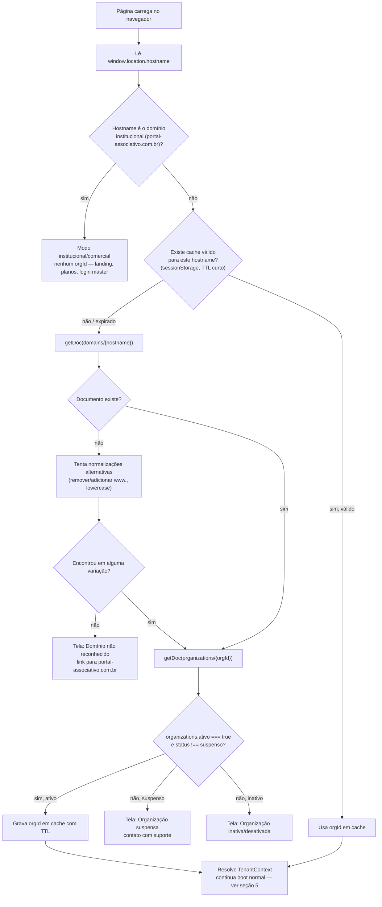
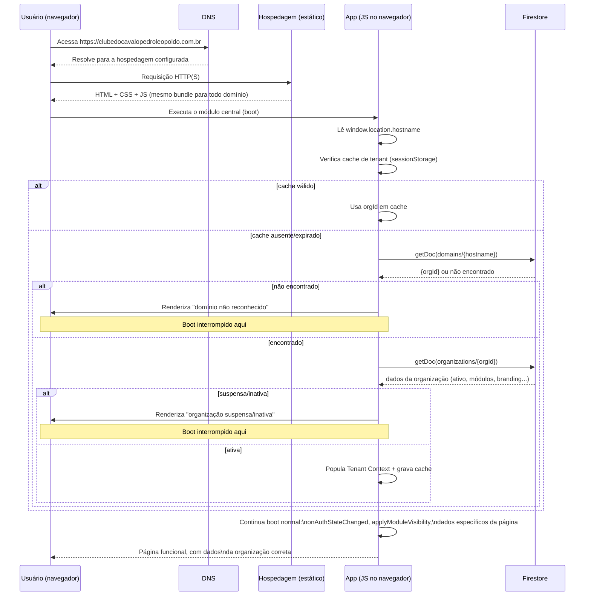
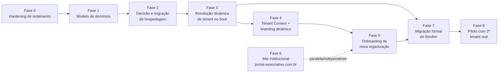

# SaaS Multi-Tenant — Diagnóstico, Gap Analysis e Plano de Evolução

> **Arquivado (agosto de 2026).** Gap-analysis original que motivou a evolução multi-tenant da plataforma. Praticamente todos os gaps identificados aqui (G1–G4 e outros) já foram resolvidos — em particular G4 (resolução de tenant por hostname) pelas Fases 3.9/3.10, documentadas em `portal-associativo/docs/roadmap/FASE3_9_TENANT_RESOLVER_HOSTNAME_REPORT.md` e `FASE3_10_TENANT_RESOLVER_SEM_FALLBACK_E_DOMINIOS_REPORT.md`. Para o estado atual do modelo multi-tenant, ver `portal-associativo/CLAUDE.md`. Mantido aqui como registro histórico do diagnóstico original, não como plano em aberto.
>
> **Status original deste documento**: análise técnica preparatória. Nenhuma linha de código foi alterada para produzi-lo. Toda afirmação sobre "o que existe hoje" foi verificada diretamente no código-fonte (não em suposição), com citação de arquivo/linha. Toda afirmação sobre "o que precisa existir" é proposta de arquitetura para discussão — não implementada.
>
> Complementa (não substitui) [ARCHITECTURE.md](../ARCHITECTURE.md), [DATABASE.md](../DATABASE.md), [ADMIN.md](../ADMIN.md), [FIRESTORE.md](../FIRESTORE.md), [SECURITY.md](../SECURITY.md) e [TECH_DEBT.md](../TECH_DEBT.md), que já haviam identificado o multi-tenant como incompleto (ver `TECH_DEBT.md` item 3). Este documento aprofunda especificamente o que falta para o multi-tenant *real* (resolução por domínio, isolamento de dados, N clientes simultâneos) e organiza isso em gaps classificados e um roadmap faseado.

---

## Contexto do pedido

Objetivo declarado: evoluir o sistema para SaaS multi-tenant real, com:

- domínio institucional/comercial único (`portal-associativo.com.br`) — landing, planos, funcionalidades, contato, demo, área comercial, login master;
- cada organização (cliente) acessando **seu próprio domínio** (`clubedocavalobonfim.com.br`, `clubedocavalopedroleopoldo.com.br`, `associacaoxyz.org.br`, ...), todos servindo **exatamente a mesma aplicação**;
- sem subdomínios (`bonfim.portal-associativo.com.br` está descartado);
- resolução do tenant **pelo domínio acessado**, substituindo o `currentOrgId` fixo atual.

Este documento não propõe implementação — apenas diagnostica o estado atual, mapeia os gaps e desenha, em nível de arquitetura, como a resolução por domínio, o boot da aplicação, o contexto de tenant e a configuração de organização deveriam funcionar, terminando num roadmap faseado.

---

## 1. Diagnóstico da arquitetura atual

### 1.1 O que já está pronto (multi-tenant "de dados")

| Peça | Onde está | Estado real |
|---|---|---|
| Coleção `organizations/{orgId}` | Firestore, gerida por `admin_master_associacoes.html` | CRUD completo funcional: nome, slug, CNPJ, domínio (texto livre), contato, endereço, plano, módulos, observações, `ativo` (`admin_master_associacoes.html:253-330`) |
| Campo `orgId` em coleções de negócio | `users`, `memberProducts`, `memberServices`, `memberClassifieds`, `classificados`, `auctionLots`, `auctionSales`, `auctionPayments`, `auctionNotifications`, `cms_banners`, `cms_events`, `cms_partners`, `cms_board`, `cms_gallery`, `cms_about`, `eventRegistrations`, `systemLogs` | Gravado consistentemente em **todas** as escritas feitas pelo frontend (`firebase.js` e cada tela admin sempre inclui `orgId: currentOrgId`) — ver [DATABASE.md](../DATABASE.md) |
| Filtro por `orgId` nas leituras | Praticamente todas as queries de listagem no frontend | `where("orgId","==",currentOrgId)` é o padrão em todas as páginas públicas/admin lidas |
| Módulos habilitáveis por organização | `organizations/{orgId}.modules` (mapa de booleans) + `checkModuleEnabled()`/`applyModuleVisibility()` (`firebase.js:369-402`) | Funcional: esconde elementos `data-module="X"` quando o módulo está desabilitado; cache de 10 min em `sessionStorage` |
| Painel de gestão de organizações | `admin_master.html`, `admin_master_associacoes.html`, `admin_master_configuracoes.html`, `admin_master_faturamento.html` (4 páginas) | Existem e funcionam para CRUD/visualização — mas operam sobre dados que nenhuma outra parte do sistema usa para *rotear* usuários (ver 1.2) |
| Convenção de Storage por tenant (parcial) | `tenants/{orgId}/cms/{categoria}/...` (usada pelo módulo CMS) | Só o CMS segue esse padrão; Produtos/Serviços/Classificados usam `uploads/{categoria}/...`, fora do prefixo de tenant (`storage.rules:15-20` vs `storage.rules:48-51`) |
| Auditoria com `orgId` | `systemLogs` via `logAction()` (`firebase.js:408-423`) | Grava `orgId: currentOrgId` em cada entrada, mas herda o mesmo problema de origem: sempre o valor da constante fixa |

**Conclusão da parte "pronta"**: o **modelo de dados** já foi desenhado para multi-tenant desde o início (todo documento carrega `orgId`, há uma coleção `organizations` completa, há um mapa de módulos por organização). Essa é a parte mais difícil de fazer retroativamente em um sistema já em produção, e já está feita. O que falta é inteiramente a camada de **resolução, roteamento e isolamento** em cima desse modelo.

### 1.2 O que ainda depende de `org_bonfim` (hardcoded)

| Local | Código | Efeito |
|---|---|---|
| `firebase.js:56` | `export const currentOrgId = "org_bonfim";` | **Toda** leitura/escrita do frontend em qualquer página, para qualquer usuário, em qualquer domínio, usa este valor fixo. O comentário no próprio código (`firebase.js:54-55`) já registra a intenção: *"Identificador da organização ativa. Em fase futura será derivado do domínio."* — essa fase nunca foi implementada. |
| `functions/index.js:3255` | `const orgId = 'org_bonfim';` dentro de `createEventRegistration` | A única Cloud Function que sequer referencia `orgId` (usada para filtrar vagas/duplicatas de inscrição em evento) também tem o valor fixo no backend, não recebido/validado a partir de contexto de domínio. |
| Nenhum arquivo do repositório | busca por `location.hostname`, `location.host`, `window.location` para fins de tenant | **Zero ocorrências.** Não existe, hoje, nenhum ponto do código — frontend ou backend — que leia o domínio acessado para qualquer finalidade. A resolução por domínio não está parcialmente implementada; ela **não existe**. |
| `login_master.html`, todas as páginas de organização | — | Não há nenhuma tela, rota ou lógica que trate "qual organização estou servindo agora" como uma pergunta em aberto — é sempre a mesma resposta, embutida no bundle estático. |

### 1.3 Módulos realmente multi-tenant vs. não

Multi-tenant tem duas exigências independentes: **(a) segregação de dados** (org A nunca vê/edita dados da org B) e **(b) resolução dinâmica** (o sistema descobre sozinho qual org servir). Nenhum módulo do sistema atende às duas hoje — o quadro abaixo mostra o quão longe cada um está:

| Módulo | Dado tem `orgId`? | Frontend filtra por `orgId`? | Backend (Cloud Functions) filtra por `orgId`? | Firestore Rules isolam por `orgId`? | Resolve org por domínio? |
|---|:---:|:---:|:---:|:---:|:---:|
| Associados | ✅ | ✅ | ❌ (ver 2.2) | ❌ | ❌ |
| Financeiro | ✅ | ✅ | ❌ | ❌ | ❌ |
| Eventos (CMS + inscrições) | ✅ | ✅ | ⚠️ parcial (só `createEventRegistration`) | ❌ | ❌ |
| Classificados | ✅ | ✅ | N/A (sem CF dedicada) | ❌ | ❌ |
| Produtos/Serviços | ✅ | ✅ | N/A | ❌ | ❌ |
| Leilões | ✅ | ✅ | ❌ | ❌ | ❌ |
| CMS (banners/diretoria/parceiros/galeria/sobre) | ✅ | ✅ | N/A | ❌ | ❌ |
| Painel Master | ✅ (na própria `organizations`) | ⚠️ parcial (KPIs de `admin_master.html` **não filtram** `orgId`, ver [ADMIN.md](../ADMIN.md) item 4) | — | ❌ | N/A (o master é, por definição, cross-tenant) |

**Leitura do quadro**: todo módulo tem a coluna de dados (✅) resolvida. Nenhum módulo tem as colunas de aplicação (backend/regras/resolução) resolvidas. Ou seja, hoje o sistema é multi-tenant **apenas no schema**, não em nenhuma camada de execução ou segurança.

---

## 2. Gap Analysis

Cada item abaixo foi observado diretamente no código (arquivo/linha citados). Ordenado por severidade dentro de cada categoria.

### 🔴 Crítico

#### G1 — Nenhuma resolução de tenant por domínio existe
- **O quê**: `currentOrgId` é uma constante estática (`firebase.js:56`), avaliada uma única vez na carga do módulo, igual para todo visitante independentemente do domínio/URL acessado.
- **Impacto**: é o bloqueio raiz de tudo o que foi pedido. Sem isso, um segundo domínio (`clubedocavalopedroleopoldo.com.br`) apontando para o mesmo código serviria **os dados do Clube do Cavalo de Bonfim**, não os do novo cliente — o produto não pode ser vendido a um segundo cliente sem isso.
- **Risco**: se alguém apontasse um segundo domínio para o mesmo GitHub Pages hoje (mesmo sem essa ser a intenção declarada do time), o visitante veria os associados/financeiro/leilões do Bonfim.
- **Dependências**: depende da decisão de hospedagem (G4) para sequenciamento — não faz sentido implementar resolução por domínio antes de a hospedagem suportar múltiplos domínios apontando para o mesmo app.
- **Complexidade**: Alta — não é trocar um valor, é mudar `currentOrgId` de constante síncrona para valor resolvido assincronamente no boot, o que se propaga a toda página que hoje importa `currentOrgId` esperando um valor imediato (ver §5).

#### G2 — Cloud Functions administrativas em massa não filtram por `orgId`
- **O quê**: sete Cloud Functions fazem `db.collection('users').get()` (ou equivalente) **sem nenhum `where('orgId','==',...)`**, operando sobre a coleção `users` inteira, de todas as organizações, de uma vez:

  | Função | Linha | O que faz sobre *todos* os usuários, de todas as orgs |
  |---|---|---|
  | `sendDailyPaymentReport` | `functions/index.js:80` | Monta o relatório diário de vencimentos e envia por e-mail |
  | `syncAllAssociadosToAsaas` | `functions/index.js:1025` | Cria clientes Asaas faltantes |
  | `createAsaasSubscriptions` | `functions/index.js:1192` | Cria assinaturas Asaas faltantes |
  | `fixAsaasPhoneNumbers` | `functions/index.js:1624` | Corrige telefones em massa no Asaas |
  | `asaasReconciliationDaily` | `functions/index.js:2299` | Reconciliação diária de pagamentos |
  | `auditCpfs` | `functions/index.js:3135` | Audita CPFs inválidos/ausentes |
  | `auditAsaasSync` | `functions/index.js:3196` | Audita associados sem sincronização Asaas |

- **Impacto**: com dois tenants reais, **qualquer admin de qualquer organização** que dispare uma dessas ações (todas acessíveis por botão em `admin.html`/`admin_associados.html`, protegidas apenas por `role in [admin, master]` — não por organização) processaria/auditaria/sincronizaria os associados de **todas** as outras organizações também. `sendDailyPaymentReport` é ainda mais grave: é um cron automático (não depende de nenhum clique), então a partir do segundo tenant o relatório diário passaria a misturar vencimentos de clubes diferentes no mesmo e-mail, enviado hoje para endereços fixos da Serafim Technologies/Bonfim (ver `CLAUDE.md` §Relatório Diário) — não haveria isolamento nem mesmo na comunicação por e-mail.
- **Risco**: financeiro e de confidencialidade (LGPD) — dados pessoais e financeiros de uma organização processados/expostos a operações disparadas por outra. É uma falha "silenciosa": nada quebra visualmente, os dados só passam a se misturar.
- **Dependências**: nenhuma — pode e deve ser corrigido **antes** de qualquer trabalho de domínio/hospedagem, porque não depende de resolução de tenant nenhuma: essas funções já recebem `context.auth.uid`, de onde dá para derivar `orgId` do chamador e filtrar.
- **Complexidade**: Baixa a Média por função (adicionar `.where('orgId','==', callerOrgId)` a cada uma), mas exige revisão cuidadosa de cada uma (algumas fazem `get()` sem paginação — ver [PERFORMANCE.md](../PERFORMANCE.md) — e algumas alimentam relatórios que precisam ser segmentados por destinatário, não só por filtro de query).

#### G3 — Firestore Security Rules não isolam por organização
- **O quê**: a função `canOperate()` (`firestore.rules:37`, usada por praticamente toda regra de escrita do sistema — `memberServices`, `memberProducts`, todas as `cms_*`, `eventRegistrations.update`, e o `update`/`get`/`list` de `users`) verifica **apenas o papel** (`admin`/`master`), nunca a organização. A única regra que de fato compara `orgId` é a leitura de `organizations/{orgId}` (`firestore.rules:360`, via helper `userOrgId()` definido em `firestore.rules:22-26`, mas usado só ali).
- **Impacto concreto e verificado**:
  - `allow list: if canOperate();` em `users` (`firestore.rules:228`) — qualquer `admin`, de qualquer organização, pode listar **todos** os usuários de **todas** as organizações diretamente pelo SDK do cliente, sem passar por nenhuma Cloud Function.
  - `allow update: if (isSelf(userId) && noSensitiveFieldChange()) || canOperate();` (`firestore.rules:238-240`) — um admin da organização A pode editar (nome, telefone, e até `ativo`/`role` via `canOperate()`, que ignora `noSensitiveFieldChange()`) o cadastro de um associado da organização B.
  - O mesmo padrão se repete em `memberServices`/`memberProducts` (`firestore.rules:113-121`) e em todas as coleções `cms_*` (`firestore.rules:388-428`): qualquer admin pode escrever conteúdo em qualquer organização.
  - **Storage** tem o mesmo problema em outro ponto: `tenants/{orgId}/cms/{category}/{fileName}` aceita escrita de **qualquer usuário autenticado** (nem precisa ser admin) — `storage.rules:48-51`. Este item específico já está registrado em [SECURITY.md](../SECURITY.md) achado #5.
- **Por que hoje não dói**: existe apenas uma organização real (`org_bonfim`), então "vazar para outra org" não tem com quem acontecer. O gap é adormecido, não inofensivo.
- **Risco**: é o gap de **segurança** mais sério de toda a análise — pior que G1 e G2 porque, diferente deles, um cliente comprometido (ou um admin mal-intencionado de uma organização pequena) poderia explorá-lo manualmente via SDK do Firebase sem depender de nenhuma tela do sistema.
- **Dependências**: nenhuma — corrigível e testável independentemente de domínio/hospedagem, assim que existir uma segunda organização de teste.
- **Complexidade**: Média-Alta — exige reescrever `canOperate()` (e possivelmente introduzir uma variante `canOperateOn(orgId)`) e revisar `match` a `match` quais coleções precisam de comparação de `orgId` do documento vs. `orgId` do usuário logado, incluindo casos onde o documento ainda não existe (`create`, onde `request.resource.data.orgId` precisa ser validado contra `userOrgId()`).

#### G4 — Hospedagem atual (GitHub Pages) não suporta múltiplos domínios de clientes para o mesmo site
- **O quê**: o frontend é servido por GitHub Pages a partir de um único repositório, com domínio customizado declarado em um único arquivo `CNAME` (hoje `clubedocavalobonfim.com.br` — ver arquivo `CNAME` na raiz). GitHub Pages associa **um único domínio customizado por site** (o valor do `CNAME`); apontar o DNS de um segundo domínio para os servidores do GitHub sem configurá-lo como domínio verificado desse mesmo repositório não faz o GitHub servir o conteúdo sob esse segundo domínio.
- **Impacto**: é um bloqueio de infraestrutura **anterior** a qualquer código de resolução de tenant (G1). Mesmo que `currentOrgId` já fosse resolvido dinamicamente por domínio, hoje não existe uma forma nativa de fazer `clubedocavalopedroleopoldo.com.br` e `clubedocavalobonfim.com.br` servirem os mesmos arquivos estáticos a partir do único repositório GitHub Pages atual.
- **Risco**: se não resolvido, força uma arquitetura alternativa indesejada (um repositório/site GitHub Pages por cliente, cada um com seu próprio `CNAME`) — o que contraria diretamente o requisito "todos acessando exatamente a mesma aplicação" (manter N cópias do mesmo código é o oposto de multi-tenant single-codebase).
- **Dependências**: decisão de produto/infra (não é decisão técnica menor — ver §4 para as alternativas). Bloqueia G1 e toda a fase de "resolução por domínio" até ser decidido.
- **Complexidade**: Alta, mas por ser uma decisão de plataforma, não de código complexo — a migração em si (ver §4) tende a ser mecânica uma vez decidida.

### 🟠 Alto

#### G5 — Não existe estrutura de dados para mapear domínio → organização
- **O quê**: o único campo relacionado a domínio hoje é `organizations/{orgId}.dominio`, um texto livre preenchido manualmente (`admin_master_associacoes.html:258,300`), sem índice garantido, sem validação de formato, sem unicidade garantida entre organizações, e sem suportar múltiplos domínios por organização (ex.: `www.` + apex, ou um domínio antigo mantido por transição).
- **Impacto**: mesmo resolvendo G1/G4, não há hoje um caminho de consulta eficiente e correto ("dado o hostname X, qual é o `orgId`?") — seria necessário fazer uma query de coleção inteira (`organizations` com `where("dominio","==",hostname)`), o que não escala bem e não cobre variações de domínio (`www.` vs. apex, maiúsculas/minúsculas, domínio antigo durante troca de DNS).
- **Risco**: sem uma estrutura dedicada, cada implementação futura reinventa essa busca de forma diferente e sujeita a bugs de normalização de string.
- **Dependências**: G1, G4.
- **Complexidade**: Média — ver proposta de coleção `domains/{hostname}` em §3.

#### G6 — Configuração hoje é global, não por-organização, onde deveria ser por-org
- **O quê**: `systemConfig/global` (documento único, `docs/DATABASE.md:227-228`) guarda nome da plataforma, URL base e e-mails de notificação — como um documento singleton, não como um documento por organização. Da mesma forma, os e-mails do relatório diário (`waldiney.serafim@gmail.com`, `mpmarquesnutri@gmail.com`, ver `CLAUDE.md` §Relatório Diário) e as credenciais de e-mail (`email-user`/`email-password` no Secret Manager) são únicos para todo o sistema, não por cliente.
- **Impacto**: qualquer configuração que hoje é "global" precisa ser reavaliada — algumas devem continuar globais (config da plataforma Serafim Technologies), outras devem migrar para dentro de `organizations/{orgId}` (branding, contatos, planos de mensalidade específicos daquele clube — ver G9).
- **Dependências**: nenhuma técnica direta, mas é insumo de design para §7 (Configuração da Organização).
- **Complexidade**: Média.

#### G7 — Conta Asaas única compartilhada entre organizações
- **O quê**: a chave de API do Asaas (`asaas-api-key` no Secret Manager) e o token de webhook (`asaas-webhook-token`) são globais ao projeto Firebase (`CLAUDE.md` §Integração Asaas), não por organização. Todos os clientes/assinaturas de todos os tenants seriam criados na **mesma conta Asaas**, apenas diferenciados por `externalReference` (UID do Firebase).
- **Impacto**: financeiramente funciona (cada assinatura tem seu próprio `externalReference` e cobranças ficam corretamente atreladas a cada associado), mas mistura, na mesma conta Asaas, o extrato financeiro de clubes de clientes diferentes — o que pode ser inaceitável do ponto de vista comercial/contábil (um cliente pagante do SaaS não deveria ver, nem indiretamente, movimentação de outro). Também significa que toda a plataforma depende de uma única credencial Asaas — um problema dela afeta todos os tenants simultaneamente.
- **Risco**: Alto se o modelo de negócio pressupuser que cada organização gerencia sua própria conta Asaas (split de recebíveis, notas fiscais próprias, etc.); Médio/aceitável se a Serafim Technologies pretende operar como intermediária única (marketplace de pagamentos) — **decisão de produto, não só técnica**.
- **Dependências**: nenhuma técnica direta com G1-G4, mas deve ser decidida antes do onboarding do primeiro tenant pagante real, pela dificuldade de migrar assinaturas ativas entre contas Asaas depois.
- **Complexidade**: Alta se decidido migrar para conta por organização (múltiplas credenciais no Secret Manager, roteamento de qual chave usar por `orgId` em cada Cloud Function que fala com o Asaas — hoje `getSecret()` é chamado sem parametrização por org).

#### G8 — KPIs e telas do Painel Master não segregam dados entre organizações
- **O quê**: `admin_master.html` soma `users` com `role != "master"` e `auctionLots` com `status == "publicado"` **sem filtrar por `orgId`** (já registrado em [ADMIN.md](../ADMIN.md) item 4). `admin_master_faturamento.html` trata `orgId` como texto livre no formulário de assinatura SaaS, sem vínculo com `organizations` reais (ADMIN.md item 3).
- **Impacto**: hoje é só uma métrica "errada" (soma 1 org como se fossem N, mas N=1). Em produção multi-tenant, os KPIs do master (que é, por definição, cross-tenant — o master *deveria* ver o total de todas as orgs) continuam corretos em soma, mas a tela não oferece nenhuma quebra por organização, o que a torna pouco útil operacionalmente com múltiplos clientes.
- **Dependências**: nenhuma técnica direta com G1-G4.
- **Complexidade**: Baixa-Média — é uma tela, não uma mudança estrutural.

### 🟡 Médio

#### G9 — Planos de mensalidade do clube são hardcoded, não configuráveis por organização
- **O quê**: os 3 planos de anuidade do associado (Mensal R$30 / Trimestral R$85 / Semestral R$170, ver `CLAUDE.md` §Planos e valores) estão fixos no código (`pay.html` e Cloud Functions relacionadas), não em `organizations/{orgId}`.
- **Impacto**: cada organização nova precisaria dos mesmos valores do Bonfim ou de uma alteração de código para ter valores próprios — inviável comercialmente para clubes com mensalidades diferentes.
- **Dependências**: G6/§7.
- **Complexidade**: Média.

#### G10 — `seedMultiTenantData`/`migrateToMultiTenant` chamadas pela UI mas ausentes no backend
- Já documentado em [TECH_DEBT.md](../TECH_DEBT.md) item 1. Relevante aqui porque `migrateToMultiTenant` é exatamente o tipo de ferramenta que a migração de dados legados (§9) precisaria — hoje é só um botão que falha.
- **Complexidade**: Média.

#### G11 — `systemPlans` "fantasma" + `PLAN_MODULES` duplicado em 3 arquivos
- Já documentado em [TECH_DEBT.md](../TECH_DEBT.md) item 2. Relevante aqui porque, com múltiplas organizações reais, divergência entre os 3 hardcodes (`admin_master.html`, `admin_master_associacoes.html`, `admin_master_faturamento.html`) deixa de ser teórica.
- **Complexidade**: Média.

#### G12 — Convenção de Storage inconsistente entre módulos (`uploads/*` fora do prefixo de tenant)
- Já documentado em [TECH_DEBT.md](../TECH_DEBT.md) item 8. Relevante aqui porque Produtos/Serviços/Classificados de organizações diferentes cairiam no mesmo prefixo `uploads/products/...`, `uploads/services/...`, `uploads/classifieds/...` — sem colisão de nome de arquivo (nomes são únicos por timestamp, `firebase.js:587-591`), mas sem qualquer possibilidade de aplicar regra de Storage por organização nesse caminho hoje.
- **Complexidade**: Média.

### 🟢 Baixo

#### G13 — Falta de paginação em telas que listam por organização
- `admin_associados.html` carrega toda a coleção `users` da organização de uma vez ([DATABASE.md](../DATABASE.md) §Consultas mais relevantes). Como já é filtrado por `orgId`, o problema não é de isolamento, só de escala — relevante apenas para organizações grandes, não é um bloqueio do multi-tenant em si.

#### G14 — Auditoria (`systemLogs`) inconsistente
- Já documentado em [TECH_DEBT.md](../TECH_DEBT.md) item 11. Ganha importância em ambiente multi-tenant/LGPD com múltiplos clientes, mas não bloqueia a arquitetura.

#### G15 — Ausência de testes de integração reais para 2 tenants simultâneos
- A suíte Playwright atual é majoritariamente estática ([TECH_DEBT.md](../TECH_DEBT.md) item 19). Qualquer trabalho de isolamento (G2, G3) deveria ganhar um teste que **prova negativamente** o isolamento (org A não consegue ler/escrever dados de org B) — inexistente hoje porque só existe uma org para testar.

---

## 3. Tenant Resolution

### 3.1 Princípio geral

A resolução de tenant deve responder a uma pergunta simples antes de qualquer outra coisa acontecer na página: **"dado o hostname que o navegador está acessando, qual é o `orgId`?"** — e essa resposta deve estar disponível (ou o boot deve ser interrompido com uma tela apropriada) antes que qualquer leitura de dado de negócio (associados, financeiro, CMS, leilões) seja feita.

Hoje isso é trivial porque a resposta é uma constante. Ao virar dinâmica, a resolução se torna a **primeira etapa assíncrona obrigatória do boot da aplicação** (ver §5), não apenas um valor a mais.

### 3.2 Estrutura de dados proposta

Reaproveitar o campo `organizations/{orgId}.dominio` (texto livre, um único valor) não é suficiente (G5): não suporta múltiplos domínios por organização (apex + `www`, domínio legado durante transição) e não é uma chave de consulta eficiente.

Proposta: uma coleção dedicada de lookup, com o **hostname normalizado como ID do documento** — a forma mais barata e direta de consulta no Firestore (leitura por ID, sem query, sem índice composto):

```
domains/{hostnameNormalizado}
  orgId          — string, referência a organizations/{orgId}
  tipo           — "primario" | "alternativo" | "legado"
  status         — "pendente_verificacao" | "verificado" | "suspenso"
  criadoEm, verificadoEm, atualizadoEm
```

`hostnameNormalizado` = domínio em minúsculas, sem `www.` como prefixo padrão (ou com uma entrada separada para `www.` apontando para o mesmo `orgId`, dependendo da decisão de canonicalização — ver §4). `organizations/{orgId}` continua sendo a fonte de verdade sobre a organização em si (módulos, branding, plano); `domains` é só o índice de roteamento.

O documento `portal-associativo.com.br` **não** deveria existir em `domains` — a ausência de entrada é, por design, o sinal de "isto é o domínio institucional/comercial", tratado de forma totalmente separada (ver §4.3).

### 3.3 Fluxo de resolução



### 3.4 Responsabilidades

| Etapa | Responsável | Observação |
|---|---|---|
| Ler o hostname | Módulo central (substituto de `firebase.js`) | Deve normalizar (`toLowerCase()`, tratar `www.`) antes de qualquer consulta |
| Decidir modo institucional vs. tenant | Módulo central, no boot, antes de qualquer import de página tentar usar `orgId` | Não deve depender de Firestore — é uma comparação de string local contra o(s) domínio(s) institucional(is) conhecido(s) |
| Consultar `domains/{hostname}` | Módulo central | Uma única leitura por ID — barata e cacheável |
| Consultar `organizations/{orgId}` | Módulo central | Precisa dos campos usados para decidir ativo/suspenso e para popular o Tenant Context (ver §6) — pode ser combinado numa única função de resolução |
| Aplicar cache | Módulo central | Ver §3.5 |
| Decidir qual tela de erro mostrar | Módulo central expõe o resultado; cada página (ou um "shell" comum) decide como renderizar | Evita duplicar HTML de erro em toda página — ideal ter um único ponto (ex. um "app shell" ou um redirecionamento para uma página dedicada de erro de tenant) |

### 3.5 Cache

- **Nível de sessão** (`sessionStorage`, como já é feito hoje para `modules_{orgId}` em `checkModuleEnabled`, `firebase.js:369-386`): evita reconsultar `domains`/`organizations` a cada navegação de página dentro da mesma aba, já que não há SPA/roteador client-side — cada página é um reload completo.
- **TTL curto** (minutos, não horas): o cenário mais sensível é uma organização ser suspensa pelo master enquanto um usuário dela está navegando — o sistema deve refletir isso em tempo razoável, não só no próximo login. Sugestão: mesmo TTL de 10 min já usado para módulos, ou menor.
- **Chave de cache**: por hostname, não por `orgId` — o mesmo navegador pode, em teoria, visitar dois domínios de organizações diferentes em abas diferentes; `sessionStorage` é isolado por aba/origem de qualquer forma (cada domínio tem seu próprio `sessionStorage`), então isso já é naturalmente seguro — só reforça que a chave de cache não precisa (nem deve) tentar ser global.
- **Invalidação manual**: ações administrativas sensíveis (master suspende uma organização) deveriam, no mínimo, ser refletidas na próxima requisição a `organizations/{orgId}` — não é necessário push em tempo real (`onSnapshot`) para isso; um TTL curto já cobre o caso de uso com atraso aceitável.

### 3.6 Tratamento de erro — três estados distintos

| Estado | Condição | Comportamento esperado |
|---|---|---|
| **Domínio inexistente** | Nenhum documento em `domains` corresponde ao hostname (após tentar variações de `www.`) | Página informativa, sem tentar carregar nenhum dado de negócio; call-to-action para o site institucional (`portal-associativo.com.br`) — este é também o estado que protege contra domínios "órfãos" apontados por engano ou de forma maliciosa para a infraestrutura |
| **Organização suspensa** | `domains` resolve, `organizations/{orgId}.ativo === false` com motivo de suspensão administrativa (inadimplência do cliente SaaS, decisão comercial) | Página informando suspensão, com contato de suporte — **não** deve ser confundida com a suspensão de um *associado* dentro da organização (isso já existe e é outro conceito, ver `ativo` em `users`) |
| **Organização inexistente apesar do domínio existir** | `domains` aponta para um `orgId` que não existe mais em `organizations` (dado órfão/inconsistente) | Tratado como erro de configuração — mesma tela de "domínio não reconhecido", mas idealmente logado/alertado para o master investigar, já que isso indica um problema de dados, não uma tentativa de acesso indevido |

Nenhum desses três estados deve, em nenhuma hipótese, cair de volta para `org_bonfim` (nem qualquer outro tenant) por omissão — um fallback "silencioso" para uma organização real repetiria, para o domínio errado, exatamente a falha de isolamento que este documento existe para eliminar. A única exceção deliberada e temporária é o fallback de transição descrito em §9 (migração do Bonfim), que deve ser removido assim que a confiança na resolução dinâmica for validada.

---

## 4. Domínios — múltiplos domínios de clientes para a mesma aplicação

### 4.1 O problema de hospedagem (retomando G4)

GitHub Pages, no modelo atual, associa **um domínio customizado por repositório/site** (arquivo `CNAME`). Não há, dentro do GitHub Pages puro, um mecanismo para dizer "sirva este mesmo conteúdo estático também sob `clubedocavalopedroleopoldo.com.br` e também sob `associacaoxyz.org.br`". Isso é uma limitação de plataforma, não algo contornável só com código de aplicação.

### 4.2 Alternativas de hospedagem (para decisão do time, não uma escolha já feita aqui)

| Alternativa | Como resolveria | Vantagens | Limitações/custos |
|---|---|---|---|
| **Migrar para Firebase Hosting** | Firebase Hosting permite múltiplos domínios customizados apontando para o mesmo site/projeto, todos servindo o mesmo conteúdo, com TLS gerenciado automaticamente por domínio | Já é o mesmo projeto Firebase (`clubecavalobonfim`) usado por Auth/Firestore/Storage/Functions — reduz o número de fornecedores; continua servindo arquivos estáticos sem exigir build step, mantendo a arquitetura atual "sem servidor de aplicação"; suporta redirecionamento apex↔`www` nativamente | Exige processo de deploy próprio (`firebase deploy --only hosting`) além do `git push` atual — muda o fluxo de publicação do frontend (hoje é só `git push`, ver [DEPLOY.md](../DEPLOY.md)); número de domínios customizados por site tem um teto (verificar limite vigente na conta/plano Firebase antes de comprometer a arquitetura a isso) |
| **Proxy/CDN reverso na frente do GitHub Pages** (ex.: Cloudflare, com múltiplos domínios de clientes configurados como proxy para o GitHub Pages original) | Cada domínio de cliente é cadastrado no provedor de CDN, que repassa a requisição para o GitHub Pages existente | Mantém GitHub Pages e o fluxo de deploy atual intocados | Adiciona uma dependência de infraestrutura nova e uma camada extra de configuração por cliente (um registro por domínio no provedor); GitHub Pages, em alguns casos, rejeita tráfego cujo cabeçalho `Host` não seja o domínio configurado no `CNAME` — precisa ser validado tecnicamente antes de assumir que funciona sem ajuste adicional |
| **Um repositório/site GitHub Pages por organização** (clone do código) | Cada cliente tem seu próprio `CNAME`, cada um servido por um site GitHub Pages distinto | Nenhuma mudança de plataforma | **Contraria diretamente o requisito** "todos acessando exatamente a mesma aplicação" — sem um mecanismo de sincronização, cada cópia diverge com o tempo; não é multi-tenant single-codebase, é N deploys manuais do mesmo código — não recomendado |

Este documento não decide entre as duas primeiras opções — é uma decisão de produto/infra com implicações de custo e de processo de deploy que caberia ao time validar (inclusive testando na prática se a segunda opção realmente funciona com o `Host` header do GitHub Pages antes de descartar/adotar). O que é seguro afirmar: a terceira opção não atende ao requisito de "mesma aplicação" e deveria ser descartada.

### 4.3 O domínio institucional (`portal-associativo.com.br`)

É tecnicamente e funcionalmente diferente dos domínios de tenant: contém landing page, planos, demonstração, área comercial e login master — conteúdo que não pertence a nenhuma organização específica e não deveria carregar nenhuma lógica de resolução de tenant, módulos ou dados de associados.

Duas abordagens possíveis:
1. **Mesma base de código**, com um branch de lógica no boot: "se o hostname for o institucional, não resolva tenant, sirva as páginas comerciais" (equivalente ao nó `C`/`D` do diagrama em §3.3).
2. **Site separado** (outro repositório/deploy), compartilhando apenas o backend (mesmo projeto Firebase, para o login master funcionar contra a mesma base de usuários `role:"master"`).

A opção 2 tende a ser mais simples de manter a longo prazo (o site comercial tem ciclo de vida, público e frequência de mudança de conteúdo totalmente diferentes do portal de cada clube — provavelmente será gerenciado por marketing, não pela mesma equipe que evolui o produto SaaS) e evita que a lógica de boot da aplicação do tenant precise lidar com um "modo institucional" como caso especial permanente. Novamente, decisão de produto — registrada aqui como recomendação, não como definição.

### 4.4 Requisitos por domínio de cliente

- **DNS**: o cliente aponta seu domínio (registro `A`/`ALIAS`/`ANAME` para apex, ou `CNAME` para subdomínio, conforme exigido pelo provedor de hospedagem escolhido) para a infraestrutura da plataforma.
- **Verificação de propriedade**: a plataforma precisa confirmar que quem cadastrou o domínio realmente o controla (mecanismo típico: registro TXT de verificação, ou o próprio processo de emissão de certificado TLS já serve como verificação indireta) — hoje não existe nenhum processo de verificação, o campo `dominio` é só texto digitado no formulário master, sem validação alguma.
- **TLS**: cada domínio precisa de certificado próprio — gerenciado automaticamente pelo provedor escolhido (Let's Encrypt via GitHub Pages hoje, ou o gerenciamento de certificados do Firebase Hosting/CDN escolhido).
- **Canonicalização**: decidir e aplicar consistentemente se o domínio "oficial" de cada cliente é o apex (`clubedocavalobonfim.com.br`) ou o `www.` — hoje o `CNAME` atual usa apex sem `www`; a decisão deve ser replicável para todo novo domínio cadastrado, com redirecionamento da variante não-canônica para a canônica.

### 4.5 Impactos na arquitetura de aplicação

- Tudo que hoje é fixo por ser "o Bonfim" (título da aba, meta tags, favicon, textos institucionais hardcoded como fallback visual nas páginas — ver `ARCHITECTURE.md:57` "Padrão estático + CMS") precisa, no mínimo, funcionar corretamente enquanto o dado dinâmico da organização carrega, e idealmente refletir a organização correta assim que possível (ver §6, Tenant Context, para os campos de branding).
- Como é a **mesma aplicação estática** (mesmo HTML/JS/CSS) servida para todos os domínios, nenhuma personalização pode depender de arquivos diferentes por cliente — tudo precisa vir de dados (Firestore) resolvidos em runtime, nunca de uma variação de build por cliente (o que, aliás, está alinhado com o princípio já existente de "sem build step" do projeto).
- SEO/indexação: cada domínio de cliente deve ser indexado pelos mecanismos de busca como o site daquele clube especificamente — isso é natural nesse modelo (cada domínio serve conteúdo daquela organização, com `<title>`/meta tags que precisarão se tornar dinâmicos), sem necessidade de tratamento especial de conteúdo duplicado (não é o mesmo conteúdo por domínio, é o mesmo *código* servindo dados diferentes).

---

## 5. Inicialização da aplicação — novo processo de boot

### 5.1 Visão geral

O boot atual (ver `ARCHITECTURE.md` §2 "Fluxo Frontend") é: HTML carrega → `firebase.js` inicializa app/auth/db/storage e expõe `currentOrgId` como constante síncrona → cada página importa o que precisa e já usa `currentOrgId` imediatamente. Isso funciona porque não há nada para "esperar".

O novo boot precisa inserir uma etapa assíncrona de resolução de tenant **antes** de qualquer leitura de dado de negócio, e essa etapa pode falhar (domínio não encontrado, organização suspensa) de um jeito que deve interromper o carregamento normal da página.

### 5.2 Passo a passo (do clique do usuário até o sistema utilizável)



### 5.3 Onde essa etapa entra na ordem atual do boot

| Ordem hoje | Ordem proposta | Observação |
|---|---|---|
| 1. `firebase.js` inicializa `app`/`auth`/`db`/`storage` | 1. (igual) | Independe de tenant — Firebase App é único (mesmo projeto `clubecavalobonfim` para todos os tenants) |
| 2. `currentOrgId` já disponível como constante | 2. **Resolução de tenant** (novo — assíncrona, com os três desfechos de erro de §3.6) | Esta é a mudança estrutural: todo código que hoje lê `currentOrgId` como um valor pronto passa a depender de um valor que só existe **depois** de uma etapa assíncrona ter concluído com sucesso |
| 3. `requireAuth()`/`onAuthStateChanged` roda em paralelo, listeners de navbar (`_initNavbarUser`, `firebase.js:622-647`) | 3. (igual, mas agora depois da resolução de tenant ter sucesso) | Não faz sentido resolver "quem é o usuário logado" antes de saber "em qual organização" — um usuário pode, em tese, ter contas em organizações diferentes (mesmo CPF, orgs diferentes, UIDs diferentes) |
| 4. `applyModuleVisibility()` consulta módulos da organização | 4. (igual) | Já depende implicitamente de `currentOrgId` hoje (`firebase.js:370`) — passa a depender do valor resolvido, não mais da constante |
| 5. Página busca seus dados específicos (CMS, produtos, etc.) filtrando por `orgId` | 5. (igual) | — |

### 5.4 Implicação prática mais importante

Esta é a mudança de maior alcance em todo o roadmap: **toda página HTML precisa passar a aguardar a resolução de tenant antes de disparar qualquer outra leitura**, porque hoje cada página é um `<script type="module">` independente que importa `firebase.js` e assume `currentOrgId` pronto. Isso não é uma alteração isolada em um arquivo (`firebase.js`) — é uma alteração de contrato que se propaga a todas as ~45 páginas HTML do repositório, ainda que de forma mecânica e repetitiva (não é complexidade algorítmica, é abrangência). Ver §11 (Fase 3) e §10 (impacto por módulo) para o detalhamento de quais arquivos são tocados.

### 5.5 Casos especiais de boot

- **`login_master.html`**: não deveria passar pela resolução de tenant (é a porta de entrada do time da Serafim Technologies, cross-tenant por definição) — hoje já duplica a configuração do Firebase inline em vez de importar `firebase.js` ([TECH_DEBT.md](../TECH_DEBT.md) item 13); ao corrigir essa duplicação, importante não introduzir ali uma dependência de resolução de tenant que não faz sentido para esse fluxo.
- **Ambiente local/desenvolvimento** (`npm run serve`, `localhost:3333`): `localhost` não corresponderá a nenhum documento em `domains`. É necessário um mecanismo de override para desenvolvimento/teste (ex.: parâmetro de URL `?org=org_bonfim` ou uma variável configurável localmente) — sem isso, todo desenvolvimento e todos os testes Playwright atuais (que rodam contra `localhost:3333`, ver `playwright.config.js`) param de funcionar no primeiro passo do boot.
- **Testes e2e (Playwright)**: precisam do mesmo mecanismo de override acima, ou de um domínio de teste específico cadastrado em `domains` apontando para uma organização de teste.

---

## 6. Tenant Context — o que a aplicação inteira precisa consumir

### 6.1 Conceito

Hoje, "contexto de organização" é espalhado: `currentOrgId` (constante em `firebase.js`), mais cada tela que precisa de outro dado da organização (ex. `checkModuleEnabled` faz seu próprio `getDoc(organizations/{orgId})`, `firebase.js:379`) refaz a consulta. Não existe um objeto único, resolvido uma vez, que represente "a organização que estamos servindo agora".

Proposta: um **Tenant Context** — populado uma única vez durante o boot (§5), guardado em memória (e, para os campos não sensíveis, em cache de sessão), e consumido por toda a aplicação a partir desse ponto único, eliminando a necessidade de cada tela buscar seus próprios fragmentos.

### 6.2 Informações que devem estar disponíveis globalmente

| Categoria | Campos | Uso típico |
|---|---|---|
| **Identidade** | `orgId`, `nome`, `slug` | Toda escrita de dado precisa gravar `orgId`; `nome` para exibição (título, cabeçalhos, e-mails) |
| **Visual/Branding** | logo, favicon, cor primária/secundária, imagem de destaque | Personalização visual da mesma aplicação por cliente (ver §7 categoria Visual) |
| **Módulos** | mapa de módulos habilitados | Substitui as chamadas repetidas de `checkModuleEnabled`/`applyModuleVisibility` por uma leitura do contexto já resolvido |
| **Domínio** | domínio(s) associados, domínio canônico | Útil para montar links absolutos corretos (ex. em e-mails, QR Codes de eventos, links compartilháveis) sem hardcode |
| **Configurações** | planos de mensalidade e valores, dias de carência de inadimplência, fuso horário (hoje fixo BRT) | Elimina os valores hoje fixos em `pay.html` e nas Cloud Functions (G9) |
| **Integrações** | referência à credencial Asaas a usar (se G7 evoluir para conta por organização), remetente de e-mail | Necessário para qualquer Cloud Function que fale com serviços externos em nome da organização correta |
| **Status** | `ativo`, motivo/data de suspensão | Já resolvido durante a etapa de tenant resolution (§3.6) — mantido no contexto para checagens subsequentes na mesma sessão |
| **Auditoria (somente leitura no client)** | `createdAt` | Informativo, sem uso funcional direto pela maioria das telas |

### 6.3 Dois tipos de informação — distinção importante

- **Informação de identidade/UX** (nome, logo, cores, textos): pode ser lida do Tenant Context e usada diretamente para renderizar a interface — o pior caso de um erro aqui é uma tela com branding errado por alguns segundos até recarregar, não um vazamento de dado.
- **Informação de política/segurança** (módulos habilitados, `orgId` para gravação): o Tenant Context no cliente é sempre uma **conveniência de UX** (evita mostrar um botão de um módulo desabilitado, evita uma chamada desnecessária), nunca a autoridade final. A autoridade final continua — e deve continuar — sendo o Firestore Rules e as Cloud Functions no backend (ver G3): mesmo que o Tenant Context do cliente esteja certo, nada impede uma tentativa de escrita fora dele por um cliente malicioso; é a regra do lado do servidor que precisa impedir, não a UI.

### 6.4 Quem escreve o Tenant Context

Só o processo de resolução de tenant no boot (§3, §5) deveria popular o Tenant Context. Nenhuma tela de conteúdo deveria escrever nele diretamente — apenas o Painel Master (`admin_master_associacoes.html` e futuras telas de configuração por organização, ver §7) altera os dados de origem em `organizations/{orgId}`, que só se refletem no Tenant Context na próxima resolução (respeitando o TTL de cache de §3.5).

---

## 7. Configuração da Organização — proposta de dados completa

Expansão de `organizations/{orgId}` (hoje limitado a nome, slug, CNPJ, domínio, contato, endereço, plano, módulos, observações — `admin_master_associacoes.html:295-313`), agrupada por categoria:

### Identidade
| Campo | Descrição |
|---|---|
| `orgId` | Identificador único (hoje = slug, `admin_master_associacoes.html:294`) |
| `nome` | Nome de exibição da organização |
| `slug` | Identificador legível/URL-friendly (já existe) |
| `razaoSocial` | Nome legal, se diferente do nome de exibição |
| `cnpj` | Já existe |
| `tipoEntidade` | Ex.: clube, associação, federação — permite adaptar textos/termos ao tipo de entidade |
| `descricaoCurta` | Usada em metadados/compartilhamento social |

### Visual
| Campo | Descrição |
|---|---|
| `logoUrl` | Logo principal (navbar, e-mails) |
| `faviconUrl` | Ícone da aba do navegador |
| `corPrimaria`/`corSecundaria`/`corDestaque` | Personalização de tema dentro dos limites do design system atual (`design-system.css`, tokens `ds-*`) |
| `imagemHeroUrl` | Imagem de destaque da home, se diferente do padrão |

### Domínio
| Campo | Descrição |
|---|---|
| `dominioPrincipal` | Domínio canônico (referência à coleção `domains`, §3.2) |
| `dominiosAlternativos[]` | Outros domínios válidos que resolvem para a mesma organização (ex. `www.`, domínio legado durante transição) |
| `statusVerificacaoDominio` | Espelha o campo `status` de cada entrada em `domains`, para exibição consolidada na tela de gestão |

### Módulos
| Campo | Descrição |
|---|---|
| `modules.{associados,financeiro,classificados,eventos,parcerias,galeria,diretoria,produtos,servicos,leiloes}` | Já existe (`admin_master_associacoes.html:192-203`) — manter e expandir conforme novos módulos forem lançados (ex. Marketplace/Aplicativo do roadmap em `CLAUDE.md`) |

### Integrações
| Campo | Descrição |
|---|---|
| `asaasAccountMode` | `compartilhada` (conta única da plataforma, modelo atual) ou `dedicada` (conta própria do cliente) — decisão de produto referente a G7 |
| `asaasApiKeySecretRef`/`asaasWebhookTokenSecretRef` | Referência ao segredo específico da organização no Secret Manager, se `asaasAccountMode = dedicada` |
| `emailRemetente`/`emailSuporte` | Endereços usados em comunicações específicas dessa organização (substituindo os e-mails fixos hoje usados no relatório diário) |
| `whatsappSuporte` | Contato de suporte exibido ao associado |

### Financeiro (a organização como cliente da plataforma SaaS)
| Campo | Descrição |
|---|---|
| `plano` | `starter`\|`professional`\|`enterprise`\|`custom` (já existe) |
| `valorMensalSaaS` | Já existe em `organizationSubscriptions` (hoje desacoplado — considerar consolidar referência) |
| `statusAssinaturaSaaS` | `ativa`\|`inadimplente`\|`cancelada` (já existe em `organizationSubscriptions`) |
| `proximaCobrancaSaaS` | Já existe |

Este bloco é sobre a organização **pagando a Serafim Technologies** — não confundir com o financeiro interno do clube (mensalidade dos associados dele), que continua em `users/{uid}/finance/*` e é configurado por `planosMensalidade` abaixo.

### Configurações
| Campo | Descrição |
|---|---|
| `planosMensalidade[]` | Substitui os valores hoje fixos (Mensal R$30/Trimestral R$85/Semestral R$170) por uma lista configurável por organização (nome do plano, ciclo, valor) — endereça G9 |
| `diasCarenciaInadimplencia` | Hoje é uma constante fixa no frontend (`GRACE_OVERDUE_DAYS`, citada em `CLAUDE.md` §Autocancelamento) — deveria ser configurável por organização |
| `fusoHorario` | Hoje implicitamente BRT em todos os agendamentos de Cloud Functions — relevante só se houver expansão para fora do Brasil; registrar como campo em aberto, não uma necessidade imediata |
| `moeda` | Idem — hoje implicitamente BRL |

### Contato
| Campo | Descrição |
|---|---|
| `telefone`, `whatsapp`, `email`, `site` | Já existem |
| `endereco`, `cidade`, `estado`, `cep` | Já existem |
| `redesSociais` | Novo — links de Instagram/Facebook, se aplicável ao site institucional de cada clube |

### Segurança
| Campo | Descrição |
|---|---|
| `mastersResponsaveis[]` | UIDs de usuários `master` com permissão de gerenciar esta organização especificamente — relevante apenas se, no futuro, o papel `master` deixar de ser global e passar a ter escopo (hoje `master` é global e cross-tenant por definição, ver `firestore.rules:33`) |
| `politicaSenha` | Em aberto — hoje não há política de senha diferenciada por organização |

### Auditoria
| Campo | Descrição |
|---|---|
| `createdAt`/`createdBy` | Quando e por qual usuário master a organização foi criada |
| `updatedAt`/`updatedBy` | Já existe (`updatedAt`, `admin_master_associacoes.html:313`) — adicionar `updatedBy` |
| `ativo` | Já existe — usado hoje tanto para "suspensão administrativa" quanto potencialmente para outros estados; ver recomendação abaixo |
| `statusDetalhado` | Recomendação: desdobrar o booleano `ativo` num campo de estado mais expressivo (`provisionando`\|`ativo`\|`suspenso`\|`cancelado`), no mesmo espírito do padrão já usado para associados (`desativadoEm`/`desativadoPor`/`notaDesativacao`, ver `CLAUDE.md` — reaproveitar o mesmo padrão de auditoria de desativação, agora um nível acima, para organizações) |
| `suspensaoEm`/`suspensaoPor`/`motivoSuspensao` | Espelhando o padrão já validado em produção para desativação de associados |

---

## 8. Fluxo de criação de uma nova organização

### 8.1 Do "Cadastrar organização" ao "Sistema disponível para uso"

```mermaid
flowchart TD
    A["Master acessa admin_master_associacoes.html\ne clica Nova Organização"] --> B["Preenche dados básicos:\nnome, slug, plano, contato"]
    B --> C["Sistema cria organizations/{orgId}\ncom status = provisionando, ativo = false"]
    C --> D["Sistema aplica módulos padrão do plano\nescolhido (PLAN_MODULES)"]
    D --> E["Master cadastra domínio(s) do cliente\nem domains/{hostname} com status = pendente_verificacao"]
    E --> F["Cliente aponta DNS do seu domínio\npara a infraestrutura da plataforma"]
    F --> G{"Verificação de domínio\n(automática ou manual)"}
    G -- falhou / ainda não propagou --> F
    G -- verificado --> H["domains/{hostname}.status = verificado\nTLS emitido pelo provedor de hospedagem"]
    H --> I["Master (ou fluxo automatizado) cria o\nusuário administrador inicial da organização\n(Auth + users/{uid} com orgId e role=admin)"]
    I --> J["Master preenche/valida configuração\nfinanceira (planos de mensalidade),\nintegração Asaas e branding (ver seção 7)"]
    J --> K{"Todas as validações\nobrigatórias passaram?"}
    K -- não --> J
    K -- sim --> L["organizations/{orgId}.status = ativo\nativo = true"]
    L --> M["E-mail de boas-vindas ao admin\ninicial da organização"]
    M --> N["Sistema disponível para uso:\ndomínio do cliente resolve normalmente\n(seção 3), admin acessa e configura o resto\n(CMS, produtos, associados...)"]
```



### 8.2 Validações por etapa

| Etapa | Validação necessária | Por quê |
|---|---|---|
| Dados básicos | `slug` único entre organizações (já existe, `admin_master_associacoes.html:290-292` valida presença, mas não unicidade contra organizações existentes) | Evita colisão de `orgId` (hoje `orgId = slug`, `admin_master_associacoes.html:294`) |
| Domínio | Formato de domínio válido; não pode já existir em `domains` apontando para outra organização | Impede que um domínio seja cadastrado para duas organizações ao mesmo tempo — quebraria a resolução (§3) de forma ambígua |
| Verificação de domínio | DNS realmente aponta para a infraestrutura da plataforma antes de marcar como `verificado` | Sem isso, a organização ficaria "ativa" com um domínio que não resolve, ou pior, aceitando tráfego de um domínio que na verdade não é controlado pelo cliente |
| Usuário administrador inicial | CPF/e-mail válido; ao menos um admin deve existir antes da ativação | Uma organização sem nenhum admin fica inacessível administrativamente após a criação — mesma lógica de "primeiro acesso" já usada para associados (`primeiroAcesso: true`), aplicável aqui ao primeiro admin |
| Integração financeira | Definir explicitamente `asaasAccountMode` antes de qualquer associado poder se cadastrar/pagar naquela organização | Evita assinaturas Asaas sendo criadas antes de decidido em qual conta elas devem existir (G7) |
| Ativação final | Todos os itens acima concluídos | Só nesse ponto a organização deve ficar visível pela resolução de tenant (§3) — antes disso, mesmo que o domínio já resolva tecnicamente, o estado `provisionando`/`ativo:false` deve continuar bloqueando o acesso normal (reaproveitando o mesmo tratamento de "organização inativa" de §3.6) |

### 8.3 Acesso da equipe do cliente durante o provisionamento

Como não há subdomínios de staging (`bonfim.portal-associativo.com.br` foi descartado), o período entre "organização criada" e "domínio verificado" precisa de uma forma de o time da Serafim Technologies (e possivelmente o cliente) visualizar/configurar a organização **antes** do domínio público estar no ar. Isso já é naturalmente resolvido pelo próprio Painel Master (que é cross-tenant e não depende de resolução por domínio) para a parte de configuração; para o cliente "ver" o portal antes do DNS propagar, seria necessário o mecanismo de override de desenvolvimento já mencionado em §5.5 (ex. parâmetro de URL), usado aqui como ambiente de homologação pontual — registrado como ponto em aberto para o roadmap (§11), não uma solução definida.

---

## 9. Migração do Clube do Cavalo de Bonfim

### 9.1 Ponto de partida (favorável)

Ao contrário de uma migração típica de "sistema single-tenant virando multi-tenant", aqui **os dados já estão prontos**: todo documento de todas as coleções de negócio já grava `orgId: "org_bonfim"` (ver §1.1), e a organização já deveria existir (ou é trivial de criar) como um documento em `organizations/org_bonfim` via `admin_master_associacoes.html`. A migração não é uma migração de **dados** — é uma migração de **comportamento do código** (de constante fixa para resolução dinâmica) mantendo o mesmo resultado para o domínio já existente.

### 9.2 Sequenciamento recomendado (sem perda de dados, sem indisponibilidade, sem quebra de compatibilidade)

1. **Endurecer isolamento primeiro, com um único tenant** (G2, G3) — mudanças de baixo risco justamente porque, com uma única organização real, adicionar filtros de `orgId` a Cloud Functions e regras não muda nenhum resultado observável hoje (o filtro por `orgId="org_bonfim"` sobre uma base onde 100% dos documentos já têm `orgId="org_bonfim"` é uma operação neutra) — mas valida que o código de filtro está correto **antes** de haver uma segunda organização para a qual um erro teria consequência real.
2. **Criar/confirmar `organizations/org_bonfim`** com os dados reais do clube (nome, contato, branding — hoje só implícito no HTML/CSS estático) preenchendo os novos campos de §7 a partir dos valores atualmente hardcoded (logo, cores, textos institucionais).
3. **Cadastrar `domains/{clubedocavalobonfim.com.br}` → `orgId: "org_bonfim"`**, com `status: verificado` (o domínio já está em produção e funcionando — a "verificação" aqui é administrativa, não técnica, já que o DNS já aponta corretamente para a hospedagem há tempo).
4. **Implementar a resolução dinâmica de tenant (§3, §5) com um fallback de transição explícito e temporário**: se a resolução por `domains` falhar por qualquer motivo técnico *e* o hostname acessado for exatamente `clubedocavalobonfim.com.br` (ou `www.` dele), cair para `org_bonfim` como comportamento equivalente ao atual, em vez de mostrar a tela de erro de §3.6. Esse fallback existe só para proteger o único tenant real em produção contra um bug de rollout da nova lógica — não deve existir para nenhum outro domínio, e deve ser removido do código assim que a resolução dinâmica for validada em produção por um período (ver critério de conclusão da Fase 7 em §11).
5. **Validar em produção** que todas as páginas, com a nova lógica assíncrona de boot, carregam exatamente como antes para os usuários reais do Bonfim — nenhuma tela nova, nenhum dado novo, só a mesma experiência agora resolvida dinamicamente.
6. **Remover a constante `currentOrgId = "org_bonfim"` e o fallback de transição do passo 4**, deixando a resolução por domínio como único caminho — só depois de uma segunda organização real ter sido validada ponta a ponta (§11, Fase 8), para garantir que o "único cliente" nunca fica sem rede de segurança antes de o novo caminho estar comprovadamente confiável.

### 9.3 Por que essa ordem evita indisponibilidade

- Nenhum passo acima remove ou move dados existentes — só adiciona (`domains`, campos novos em `organizations/org_bonfim`) e, no fim, remove uma constante de código depois que o caminho alternativo já está validado havendo inclusive um fallback de segurança durante a transição.
- O endurecimento de segurança (passo 1) é feito **antes** de qualquer mudança de comportamento visível, então qualquer efeito colateral inesperado apareceria como erro de permissão para o próprio Bonfim (facilmente detectável e reversível) em vez de como vazamento silencioso de dados para um segundo tenant.
- O fallback do passo 4 é a rede de segurança que garante que, mesmo com um bug na nova lógica de resolução por domínio, o único cliente pagante real hoje não perde acesso.

---

## 10. Impacto por módulo

| Módulo | O que muda | O que permanece igual | Arquivos futuramente impactados (sem implementar agora) |
|---|---|---|---|
| **Associados** | Leitura/escrita passam a depender do `orgId` resolvido dinamicamente em vez da constante; Cloud Functions em massa (G2) precisam de filtro por `orgId` | Modelo de dados (`users`, `finance/summary`, `financeInvoices`), fluxo de primeiro acesso, papéis (`master`/`admin`/`associado`), categoria Mirim — nada disso muda estruturalmente | `firebase.js`, `admin_associados.html`, `login.html`, `signup.html`, `pg_associado.html`, `functions/index.js` (as 7 funções de G2 + triggers `onNewAssociadoCriado`/`onAssociadoAtualizado`) |
| **Financeiro** | Planos de mensalidade deixam de ser hardcoded, passam a vir de `organizations/{orgId}.planosMensalidade` (G9); potencial roteamento de credencial Asaas por organização se G7 evoluir para conta dedicada | Máquina de estados de fatura, webhook, idempotência por `asaasPaymentId`, autocancelamento/reativação | `pay.html`, `pay-success.html`, `admin_associados.html` (aba Financeiro), `functions/index.js` (funções Asaas) |
| **Eventos** | `createEventRegistration` deixa de ter `orgId` hardcoded (`functions/index.js:3255`), passa a receber/derivar da organização do evento consultado | Fluxo de inscrição, QR Code, check-in, controle de vagas | `functions/index.js`, `admin_eventos.html`, `events.html`, `event_inscricao.html`, `event_comprovante.html`, `event_checkin.html` |
| **CMS** (banners/diretoria/parceiros/galeria/sobre) | Regras de Storage e Firestore passam a exigir correspondência de `orgId` (G3, G12); branding (logo/cores) migra de HTML estático fallback para o Tenant Context (§6) | Padrão de CRUD + soft delete, estrutura de subcoleção `fotos` da galeria | Todas as páginas `admin_banners.html`, `admin_diretoria.html`, `admin_eventos.html`, `admin_galeria.html`, `admin_parceiros.html`, `admin_sobre.html`, `admin_conteudo.html`, `firestore.rules`, `storage.rules` |
| **Leilões** | Nenhuma Cloud Function do módulo filtra por `orgId` hoje (`placeBid`, `liberarRepasse`, etc. operam por `lotId`/`saleId`, não por coleção inteira, então o risco de G2 é menor aqui, mas ainda vale revisar); regras de Firestore de `auctionLots`/`auctionSales` precisam do mesmo tratamento de G3 | Máquina de estados de lote/venda, transação atômica de lance, anti-sniper, comissão | `admin_leiloes.html`, `leiloes.html`, `leilao_lote.html`, `lote_form.html`, `meus_lotes.html`, `functions/index.js`, `firestore.rules` |
| **Marketplace (Classificados)** | Mesma revisão de regras (G3); oportunidade de resolver a duplicação `classificados`/`memberClassifieds` ([TECH_DEBT.md](../TECH_DEBT.md) item 7) no mesmo momento em que as regras forem revisadas por outro motivo | Moderação, monetização por dia, upload de imagens | `classificados.html`, `admin_classificados.html`, `pg_associado.html`, `firestore.rules` |
| **Produtos** | Storage sai de `uploads/products/...` para um caminho com prefixo de tenant (G12); regras de Firestore (G3) | CRUD, compressão de imagem, campo `price` | `admin_produtos.html`, `produtos_associado.html`, `storage.rules`, `firestore.rules` |
| **Serviços** | Mesmo tratamento de Produtos | CRUD, compressão de imagem | `admin_servicos.html`, `servicos_associado.html`, `storage.rules`, `firestore.rules` |
| **Parceiros** | Regras de Firestore/Storage (G3, já parcialmente coberto pelo padrão `tenants/{orgId}/cms/...`) | CRUD, destaque na home | `admin_parceiros.html`, `partners.html`, `index.html` |
| **Diretoria** | Idem Parceiros | CRUD | `admin_diretoria.html`, `board.html` |
| **Galeria** | Idem Parceiros | CRUD, subcoleção de fotos | `admin_galeria.html`, `gallery.html` |
| **Master** | Ganha as novas telas/campos de §7 (domínios, branding, configurações financeiras por org) e o novo fluxo de criação de §8; KPIs passam a poder segmentar por organização (G8) | Estrutura de papel `master` como cross-tenant, CRUD básico de organizações já existente | `admin_master.html`, `admin_master_associacoes.html`, `admin_master_configuracoes.html`, `admin_master_faturamento.html`, nova coleção `domains` |

---

## 11. Roadmap Técnico

Fases desenhadas para serem implementáveis e validáveis **independentemente**, na ordem em que reduzem risco mais cedo (segurança antes de infraestrutura, infraestrutura antes de comportamento dinâmico, comportamento dinâmico antes de onboarding comercial).



### Fase 0 — Hardening de isolamento (segurança, sem depender de domínio novo)
- **Objetivo**: eliminar G2 e G3 — garantir que, mesmo antes de qualquer domínio novo existir, o sistema já seria seguro para operar com múltiplas organizações.
- **Pré-requisitos**: nenhum além do estado atual do código.
- **Entregáveis**: as 7 Cloud Functions de G2 passam a filtrar por `orgId` do chamador; `firestore.rules` e `storage.rules` passam a validar `orgId` do documento contra `orgId` do usuário logado em toda escrita hoje protegida só por `canOperate()`.
- **Riscos**: regressão funcional para o Bonfim se o filtro for aplicado incorretamente (mitigado por ser, hoje, uma mudança comportamentalmente neutra — só há uma organização, então o filtro correto não deveria alterar nenhum resultado observável).
- **Dependências**: nenhuma.
- **Critérios de conclusão**: existe um teste (mesmo que manual, idealmente automatizado — endereçando G15) que cria uma segunda organização de teste e comprova que um admin dela não consegue ler/escrever dados da primeira, nem via SDK direto nem via nenhuma Cloud Function.

### Fase 1 — Modelo de dados de domínios
- **Objetivo**: criar a estrutura de dados de §3.2 (coleção `domains`) e a gestão dela no Painel Master.
- **Pré-requisitos**: Fase 0 concluída (não é bloqueio técnico direto, mas evita construir cadastro de domínios sobre uma base ainda insegura).
- **Entregáveis**: coleção `domains` funcional; `admin_master_associacoes.html` ganha gestão de domínio(s) por organização (substituindo o campo de texto livre atual).
- **Riscos**: baixo — é aditivo, não altera comportamento de nenhuma página pública ainda.
- **Dependências**: nenhuma.
- **Critérios de conclusão**: é possível, pelo Painel Master, cadastrar um domínio para uma organização e consultá-lo de volta corretamente; unicidade entre organizações é garantida.

### Fase 2 — Decisão e migração de hospedagem
- **Objetivo**: resolver G4 — viabilizar múltiplos domínios de clientes servindo o mesmo conteúdo estático.
- **Pré-requisitos**: decisão de produto/infra entre as alternativas de §4.2.
- **Entregáveis**: hospedagem escolhida configurada e testada com pelo menos dois domínios de teste apontando para o mesmo conteúdo; `clubedocavalobonfim.com.br` migrado sem indisponibilidade perceptível.
- **Riscos**: é a fase de maior risco operacional do roadmap (mexe com DNS/TLS do domínio de produção real) — deve ser feita com janela de baixo tráfego e plano de rollback (reverter DNS) definido antes de executar.
- **Dependências**: Fase 1 (para já ter onde cadastrar o(s) domínio(s) de teste).
- **Critérios de conclusão**: `clubedocavalobonfim.com.br` funcionando normalmente na nova hospedagem, mais um segundo domínio de teste servindo o mesmo conteúdo com sucesso.

### Fase 3 — Resolução dinâmica de tenant no boot
- **Objetivo**: implementar §3 e §5 — substituir `currentOrgId` fixo pela resolução assíncrona por domínio, com os três tratamentos de erro de §3.6.
- **Pré-requisitos**: Fases 0, 1 e 2 concluídas.
- **Entregáveis**: módulo central de resolução de tenant; todas as páginas adaptadas ao novo contrato assíncrono (ver §5.4); mecanismo de override para desenvolvimento/testes (§5.5).
- **Riscos**: maior superfície de mudança mecânica (toca ~45 páginas) — risco de regressão pontual em páginas menos testadas; mitigado por ser mudança repetitiva e padronizável, não lógica de negócio nova.
- **Dependências**: Fases 0-2.
- **Critérios de conclusão**: toda a suíte de testes e2e existente voltando a passar contra o novo boot; navegação manual completa do Bonfim (login, associado, admin, master) validada sob o novo mecanismo, usando o fallback de transição de §9.2 passo 4.

### Fase 4 — Tenant Context completo + branding dinâmico
- **Objetivo**: implementar §6 e a parte "Visual"/"Configurações" de §7 — personalização real por organização (logo, cores, planos de mensalidade, dias de carência).
- **Pré-requisitos**: Fase 3.
- **Entregáveis**: Tenant Context único consumido por toda a aplicação; `organizations/{orgId}` expandido com os campos de §7; `pay.html` e Cloud Functions financeiras lendo planos de mensalidade da organização em vez de valores fixos (G9).
- **Riscos**: médio — envolve várias telas de conteúdo institucional que hoje têm HTML estático de fallback; risco de inconsistência visual durante a transição se algumas páginas migrarem e outras não.
- **Dependências**: Fase 3.
- **Critérios de conclusão**: alterar o logo/cor/plano de mensalidade de `org_bonfim` pelo Painel Master reflete corretamente no site público sem alteração de código.

### Fase 5 — Onboarding de nova organização (fluxo completo)
- **Objetivo**: implementar §8 — processo ponta a ponta de criação de uma nova organização, incluindo verificação de domínio e criação de admin inicial.
- **Pré-requisitos**: Fases 1-4.
- **Entregáveis**: fluxo completo (ou majoritariamente automatizado, com etapas manuais claramente identificadas) descrito em §8.1; `seedMultiTenantData`/`migrateToMultiTenant` (G10) resolvidos — implementados de fato ou removidos da UI se a necessidade que os motivou for coberta de outra forma.
- **Riscos**: médio — depende de decisões de produto ainda em aberto (G7, verificação de domínio automática vs. manual).
- **Dependências**: Fases 1-4.
- **Critérios de conclusão**: uma organização fictícia de teste é criada do zero pelo fluxo, com domínio de teste, e fica operacional sem intervenção manual fora do fluxo desenhado.

### Fase 6 — Site institucional (`portal-associativo.com.br`)
- **Objetivo**: landing, planos, funcionalidades, contato, demonstração, área comercial e login master, conforme §4.3.
- **Pré-requisitos**: nenhum técnico direto das fases anteriores — pode ser conduzida em paralelo, especialmente se a decisão for por um site separado (§4.3, opção 2).
- **Entregáveis**: domínio institucional no ar, com login master funcional contra a mesma base de usuários `master`.
- **Riscos**: baixo, se tratado como site separado; médio, se integrado ao mesmo boot da aplicação de tenant (exigiria coordenação com a Fase 3).
- **Dependências**: login master precisa continuar funcionando (`login_master.html`) — se migrado, revisar junto o item de dívida técnica ([TECH_DEBT.md](../TECH_DEBT.md) item 13, configuração Firebase duplicada).
- **Critérios de conclusão**: `portal-associativo.com.br` no ar com o conteúdo comercial completo e login master operacional.

### Fase 7 — Migração formal do Bonfim
- **Objetivo**: concluir §9 — remover o fallback de transição e a constante `currentOrgId`, deixando `org_bonfim` operando 100% pelo novo mecanismo, sem rede de segurança especial.
- **Pré-requisitos**: Fase 3 validada em produção por um período de observação (sugestão: sem incidentes relacionados a resolução de tenant por pelo menos algumas semanas de operação real).
- **Entregáveis**: fallback de transição removido; constante antiga removida do código.
- **Riscos**: baixo, se o critério de conclusão da Fase 3 já tiver sido cumprido com folga.
- **Dependências**: Fase 3.
- **Critérios de conclusão**: `org_bonfim` opera exclusivamente pela resolução dinâmica, sem nenhum caminho de código fazendo referência à string `"org_bonfim"` como valor fixo.

### Fase 8 — Piloto com um segundo tenant real
- **Objetivo**: validar toda a arquitetura (Fases 0-7) com um segundo cliente real e simultâneo, não apenas dados de teste.
- **Pré-requisitos**: Fases 0-7 concluídas.
- **Entregáveis**: segunda organização real operando em produção, com seu próprio domínio, simultaneamente ao Bonfim.
- **Riscos**: é o teste definitivo de todo o roadmap — qualquer gap não coberto nas fases anteriores se manifesta aqui; recomenda-se escolher, se possível, um cliente piloto com relação de confiança/tolerância a ajustes finos durante o período inicial.
- **Dependências**: todas as fases anteriores.
- **Critérios de conclusão**: os dois tenants operam de forma completamente isolada e simultânea (financeiro, associados, conteúdo, domínio) sem nenhuma interferência mútua observável — este é o critério que efetivamente define o sistema como "SaaS multi-tenant funcional", não apenas "preparado para".
