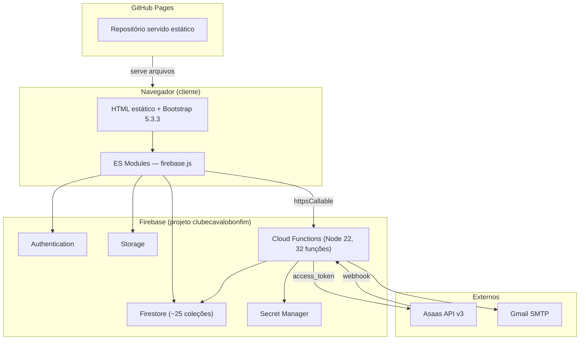

# Visão Geral da Arquitetura

```mermaid
graph TB
    subgraph Browser["Navegador (cliente)"]
        HTML["HTML estático + Bootstrap 5.3.3"]
        JSMOD["ES Modules — firebase.js"]
        HTML --> JSMOD
    end

    subgraph GH["GitHub Pages"]
        REPO["Repositório servido estático"]
    end

    subgraph FB["Firebase (projeto clubecavalobonfim)"]
        AUTH["Authentication"]
        FS["Firestore (~25 coleções)"]
        ST["Storage"]
        CF["Cloud Functions (Node 22, 32 funções)"]
        SM["Secret Manager"]
    end

    subgraph EXT["Externos"]
        ASAAS["Asaas API v3"]
        GMAIL["Gmail SMTP"]
    end

    GH -- serve arquivos --> Browser
    JSMOD --> AUTH
    JSMOD --> FS
    JSMOD --> ST
    JSMOD -- httpsCallable --> CF
    CF --> FS
    CF --> SM
    CF -- access_token --> ASAAS
    ASAAS -- webhook --> CF
    CF --> GMAIL
```

Ver explicação completa em [../ARCHITECTURE.md](../ARCHITECTURE.md).
