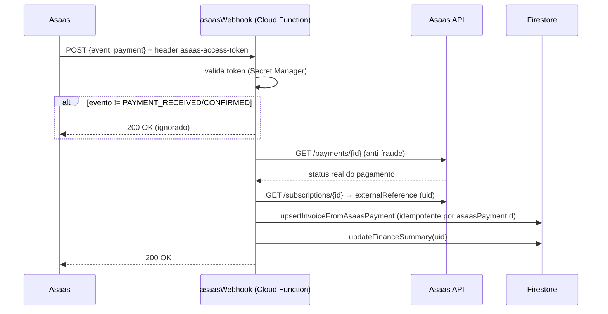

# Webhook Asaas (mensalidade)

O webhook de leilão (`auctionAsaasWebhook`) segue exatamente o mesmo padrão, com token próprio (`ASAAS_AUCTION_WEBHOOK_TOKEN`) e resolvendo `saleId` (em vez de `uid`) via `payment.externalReference`. Ver [../ASAAS.md](../ASAAS.md).
