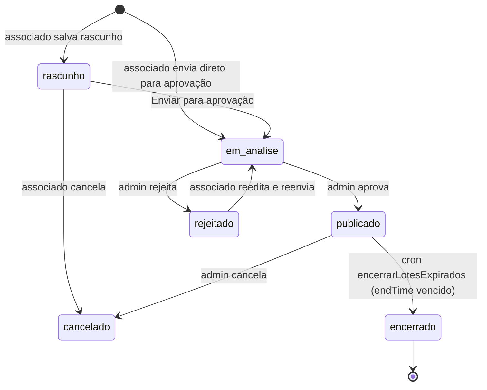
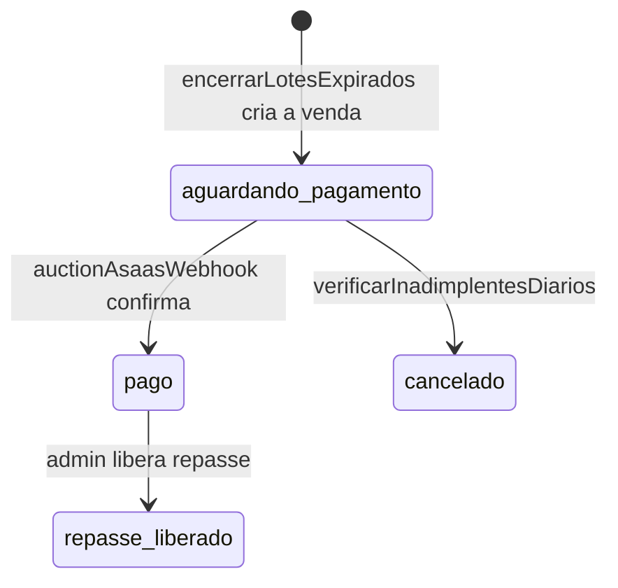

# Máquina de Estados — Leilão

## Lote (`auctionLots.status`)

## Venda (`auctionSales.status`)

Nota: `concluido` aparece em filtros de UI mas nunca é gravado por nenhum código do sistema — ver [../TECH_DEBT.md](../TECH_DEBT.md) item 17.

Contexto completo em [../FLOWS.md](../FLOWS.md).
