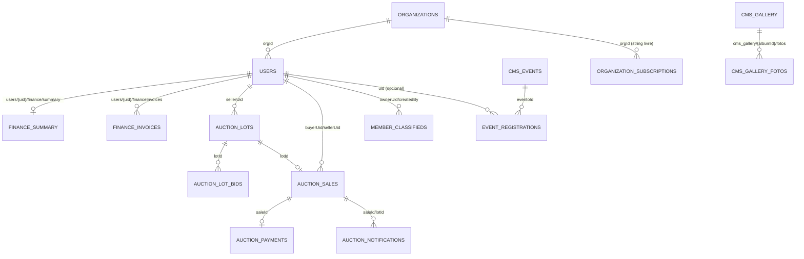

# Relacionamento entre Coleções Firestore

```mermaid
erDiagram
    ORGANIZATIONS ||--o{ USERS : "orgId"
    USERS ||--o| FINANCE_SUMMARY : "users/{uid}/finance/summary"
    USERS ||--o{ FINANCE_INVOICES : "users/{uid}/financeInvoices"
    USERS ||--o{ AUCTION_LOTS : "sellerUid"
    USERS ||--o{ AUCTION_SALES : "buyerUid/sellerUid"
    USERS ||--o{ MEMBER_CLASSIFIEDS : "ownerUid/createdBy"
    USERS ||--o{ EVENT_REGISTRATIONS : "uid (opcional)"
    AUCTION_LOTS ||--o{ AUCTION_LOT_BIDS : "lotId"
    AUCTION_LOTS ||--o| AUCTION_SALES : "lotId"
    AUCTION_SALES ||--o| AUCTION_PAYMENTS : "saleId"
    AUCTION_SALES ||--o{ AUCTION_NOTIFICATIONS : "saleId/lotId"
    CMS_EVENTS ||--o{ EVENT_REGISTRATIONS : "eventoId"
    CMS_GALLERY ||--o{ CMS_GALLERY_FOTOS : "cms_gallery/{albumId}/fotos"
    ORGANIZATIONS ||--o{ ORGANIZATION_SUBSCRIPTIONS : "orgId (string livre)"
```

Ver schema completo de campos em [../DATABASE.md](../DATABASE.md).
