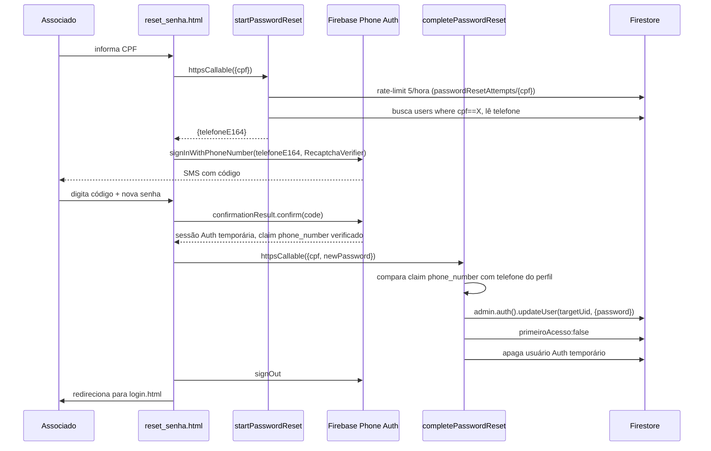

# Redefinição de Senha via SMS (Firebase Phone Auth)

A barreira de segurança real é o **claim `phone_number` assinado pelo Firebase** (não falsificável pelo cliente), não o CPF em si. Ver [../AUTHENTICATION.md](../AUTHENTICATION.md).
