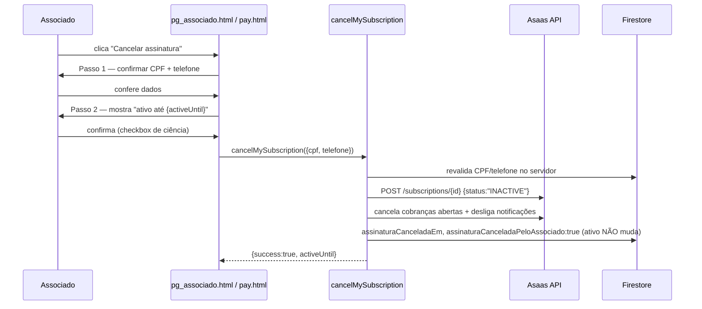

# Cancelamento e Reativação de Assinatura (self-service)

Reativação (`reactivateMySubscription`) é o inverso: reativa a assinatura (`ACTIVE`), religa notificações, gera cobrança avulsa imediata, remove os campos de cancelamento. Bloqueada se `ativo===false` (desativação administrativa é um mecanismo separado — ver [../GLOSSARY.md](../GLOSSARY.md)).

Contexto completo em [../FLOWS.md](../FLOWS.md) e [../ASAAS.md](../ASAAS.md).
